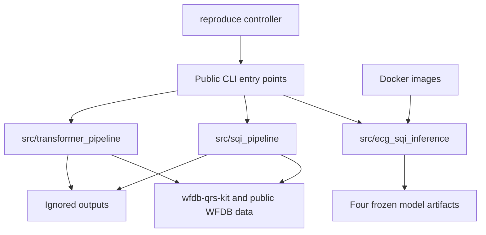

# Code Architecture

The repository separates stable inference from research pipelines and from
generated evidence.



## Responsibility map

| Path | Responsibility |
|---|---|
| `src/ecg_sqi_inference/` | Stable file loading, segmentation, predictors, and output contracts |
| `src/sqi_pipeline/` | Classical Set-A preprocessing, QRS detection, SQIs, fusion models, and audits |
| `src/transformer_pipeline/` | v116 construction, frozen splits, E31 waveform training, and audits |
| `src/supplemental_*` | Report-supporting analyses; not a public API |
| `reproduce/` | Clean-clone target execution and expected-output checks |
| `docker/` | Data-free inference and isolated reproduction wrappers |
| `pretrained/` | Four inference artifacts plus runtime profiles |
| `tests/` | Inference, metric-contract, and reproduction checks |
| `outputs/` | Regenerable evidence; ignored by Git |

## Classical stage contract

`SQIPipelineConfig` resolves repository-relative paths and profile parameters.
`run_pipeline` selects an ordered `StepSpec` sequence. Each stage receives a
plain parameter dictionary and must return a dictionary containing its output
paths and reusable metadata. The runner records duration, skipped status, and
repository-relative outputs in a JSON summary.

## Stable versus historical code

The supported waveform entry point is `src.transformer_pipeline.cli`. Numbered
builders under `data_v1_gapfill/support/` form the implementation lineage

```text
v2 -> v14 -> v21 -> v37 -> v81 -> v114 -> v115 -> v116
```

and are not independent user interfaces. Likewise, exploratory and revision
scripts remain research history rather than documented API.

## Path and artifact rules

- Source paths are resolved relative to the repository root.
- Raw data, generated outputs, caches, and detector binaries are not imported
  as Python packages and are excluded from commits.
- Frozen model integrity is checked before inference.
- A run summary records outputs with relative paths so another checkout can be
  compared without machine-specific absolute paths.
