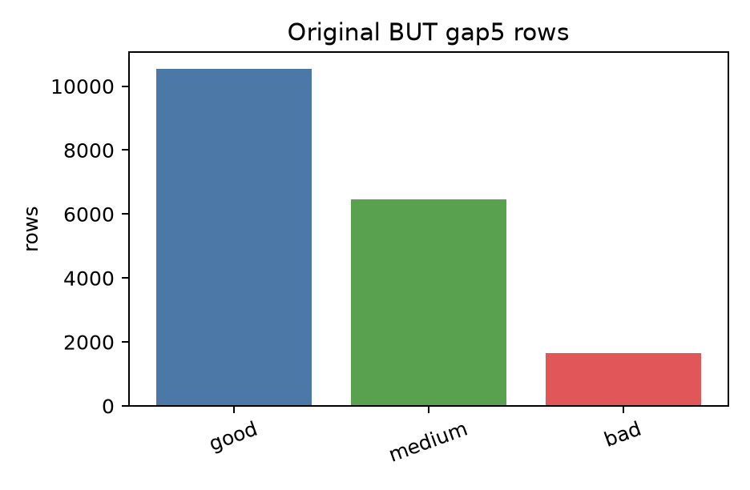
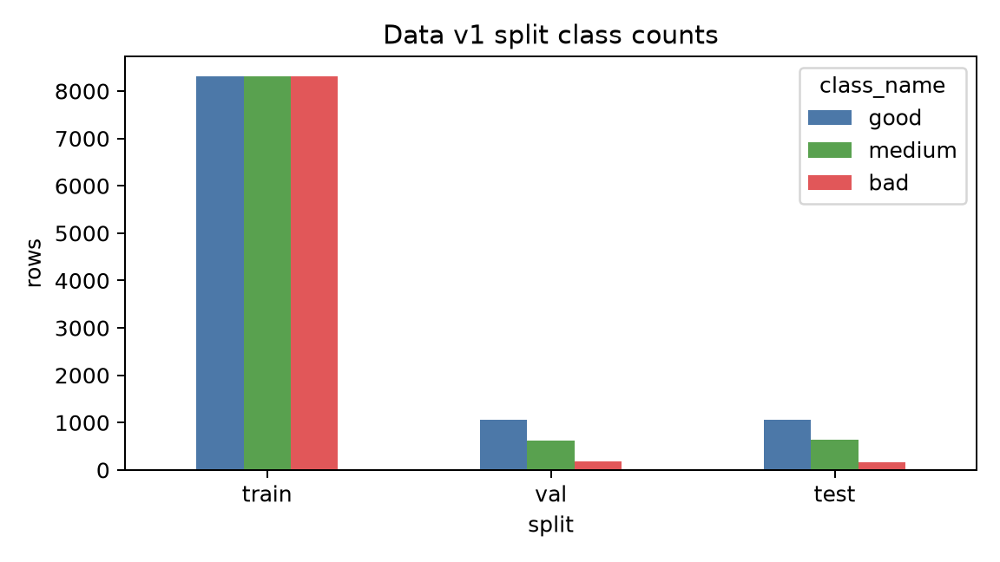
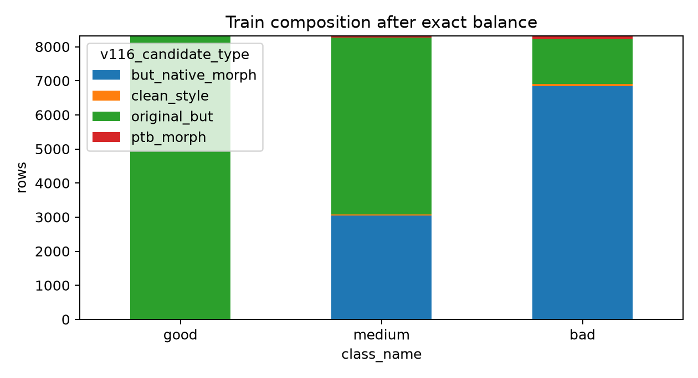
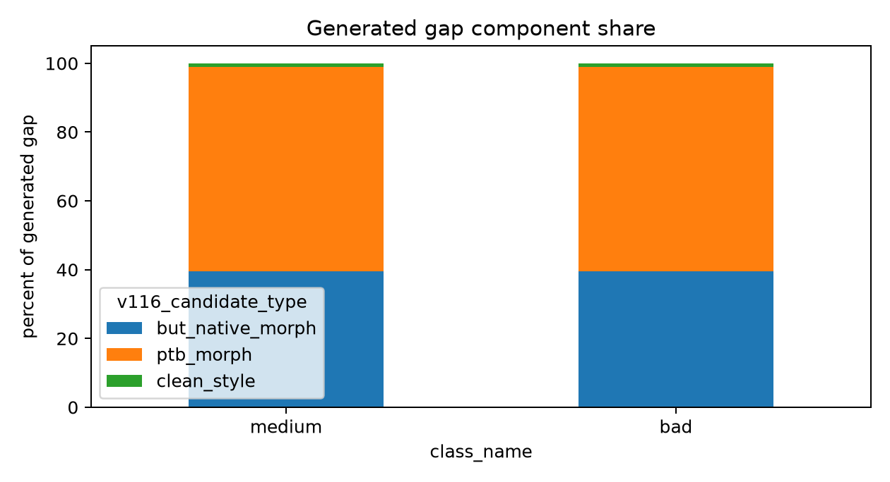
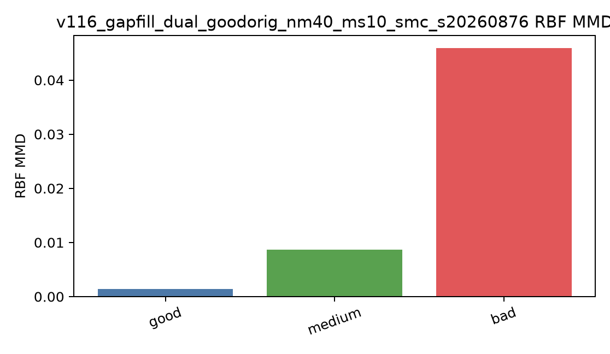
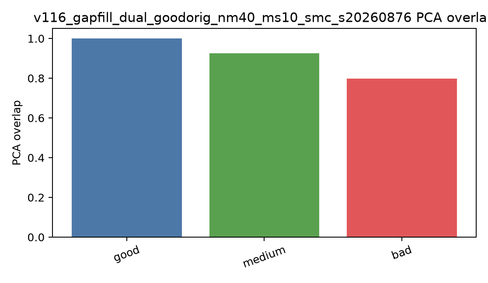
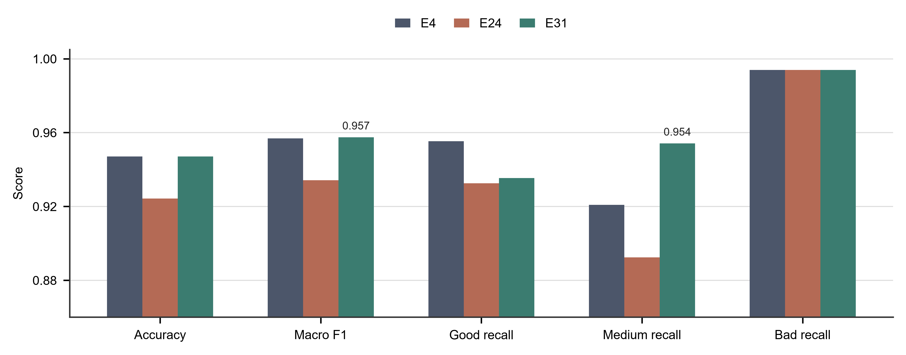

# Data v1 Gap-Fill Method

This document freezes the current reproducible data line tagged as
`data-v1.0`.

## Method Summary

Data v1 starts from the BUT gap5 extracted 10 s windows and balances only the
training split. Validation and test remain native BUT originals.

Fixed protocol:

```text
policy: v116_gapfill_dual_goodorig_nm40_ms10_smc_s20260876
seed: 20260876
final protocol rows: 31590
final class rows: good 10530, medium 10530, bad 10530
```

Original BUT gap5 rows:

```text
total  18635
good   10530
medium  6449
bad     1656
```

Original split before train balancing:

```text
train original: good 8424, medium 5199, bad 1314
val original:   good 1053, medium  618, bad  178
test original:  good 1053, medium  632, bad  164
```

Final training split after exact train-only balance:

```text
train final: good 8310, medium 8310, bad 8310
val final:   1849 rows, original_but only
test final:  1849 rows, original_but only
```

The 114 surplus good train originals and surplus train-linked generated rows are
marked `unused`; they are not deleted from the protocol bundle.

## Generation Rules

Candidate labels are part of the public protocol contract:

```text
original_but
but_native_morph
ptb_morph
clean_style
```

Rules:

- `good` is not generated for the final balanced protocol.
- `medium` and `bad` keep all eligible original BUT rows, then fill only the
  training gap.
- `but_native_morph` uses BUT carriers with small morphology/acquisition
  perturbations: shift, gain, baseline drift, noise, and class-specific light
  artifact mixing.
- `ptb_morph` uses PTB carriers aligned to BUT style/residual support.
- `clean_style` is capped to a tiny supplement and is not a main component.
- Generated rows are allowed in train only when their donor/linkage resolves to
  original train support.
- Final medium/bad gap fill uses strict SMC over the generated candidate pools:
  particles are candidate subsets, each generation scores class-conditional
  robust-z waveform distribution distance, applies an epsilon accept mask,
  reweights particles, resamples, and mutates by row swaps. The large candidate
  bank is a proposal bank, not exact replay.

Current exact train composition:

```text
good:
  original_but 8310

medium:
  original_but      5199
  but_native_morph  1061
  clean_style         31
  ptb_morph         2019

bad:
  original_but      1314
  but_native_morph  2393
  clean_style         68
  ptb_morph         4535
```

## Audits

Main data-side acceptance is dual-view waveform generated-vs-original
separability, evaluated only on `medium` and `bad`; `good` is excluded because
it has no generated rows by design. The reported audit is a 5-fold logistic AUC
over waveform-only dual-view channel summary features.

```text
medium sym AUC 0.527
bad    sym AUC 0.548
pooled sym AUC 0.512
```

Leakage and integrity checks:

```text
val/test generated rows: 0
train generated donor-split problems: 0
allowed candidate types:
  original_but, but_native_morph, ptb_morph, clean_style
missing class rows: 0
missing signal idx rows: 0
```

## Model Check

Training uses raw rows, not the record-balanced sampler.

Model input remains:

```text
signals.npz -> dual-view waveform channels
```

No SQI table columns are concatenated to the model input. Factor/SQI-like targets
remain auxiliary supervision, so the model can learn SQI-like waveform
representations but does not receive SQI features as inputs.

Exact-balanced checks:

```text
E4:
  val  acc 0.9513, macro F1 0.9547
  test acc 0.9470, macro F1 0.9569
  test recalls: good 0.9554, medium 0.9209, bad 0.9939

E24:
  val  acc 0.9410, macro F1 0.9444
  test acc 0.9243, macro F1 0.9342
  test recalls: good 0.9326, medium 0.8924, bad 0.9939

E31_wave_mechanism_conformer:
  val  acc 0.9432, macro F1 0.9488
  test acc 0.9470, macro F1 0.9574
  test recalls: good 0.9354, medium 0.9541, bad 0.9939
```

## Reproduction Commands

Audit the current materialized protocol:

```powershell
python -m src.transformer_pipeline.data_v1_gapfill audit
```

Create the small method figures:

```powershell
python -m src.transformer_pipeline.data_v1_gapfill plot
```

Print the exact protocol build command:

```powershell
python -m src.transformer_pipeline.data_v1_gapfill build
```

Run the exact protocol build command:

```powershell
python -m src.transformer_pipeline.data_v1_gapfill build --run
```

Print the exact split command:

```powershell
python -m src.transformer_pipeline.data_v1_gapfill split
```

Run the exact split command:

```powershell
python -m src.transformer_pipeline.data_v1_gapfill split --run
```

Print the exact E31 training check command:

```powershell
python -m src.transformer_pipeline.data_v1_gapfill train-check --model E31
```

Run the exact E31 training check:

```powershell
python -m src.transformer_pipeline.data_v1_gapfill train-check --model E31 --run
```

Run the full line:

```powershell
python -m src.transformer_pipeline.data_v1_gapfill pipeline --run --train E31
```

## Figures














