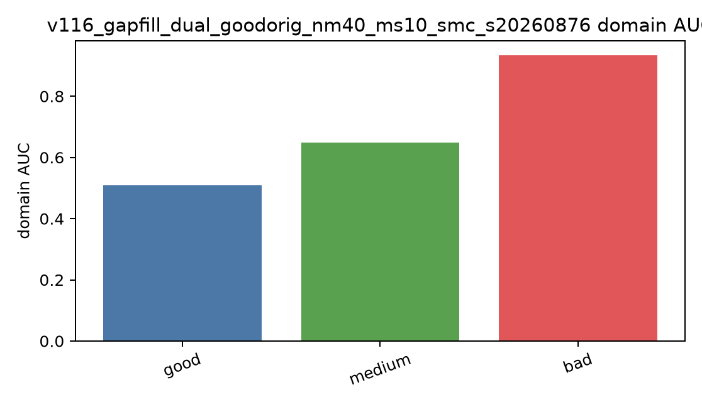

# Findings

## 1. The classical fusion pattern was reproduced

The qualitative single-SQI hierarchy was broadly recovered. For predefined
feature subsets, accuracy again peaked at the five-SQI combination and did not
improve when all seven SQIs were included.

| Predefined subset | Paper accuracy | Reproduced accuracy |
|---|---:|---:|
| iSQI + basSQI | 0.945 | 0.900 |
| bSQI + basSQI + pSQI | 0.948 | 0.931 |
| bSQI + basSQI + kSQI + sSQI | 0.948 | 0.944 |
| Five-SQI paper subset | 0.949 | 0.948 |
| All seven SQIs | 0.946 | 0.939 |

The claim remains functional because the original adjudicated labels were not
available.

## 2. Fixed synthetic balancing created a source shortcut

Synthetic records formed 70.9% of the reproduced poor class. Native and fixed
synthetic poor records were strongly separable in SQI space (AUC 0.974), while
training on combined synthetic poor transferred weakly to native poor records
(AUC 0.583). Near-paper aggregate accuracy therefore did not imply equivalent
generalisation to naturally poor ECGs.

<figure markdown="span">
  
  <figcaption>Domain separability is a validity diagnostic, not a model-performance score.</figcaption>
</figure>
## 3. Support-aware construction repaired most of the failure

| Audit | Fixed synthetic | SMC construction |
|---|---:|---:|
| Raw-waveform source classifier | 0.9970 | 0.8129 |
| 84-SQI source classifier | 0.9572 | 0.7973 |
| Transfer AUC | 0.8880 | 0.9294 |
| Poor recall at 95% acceptable specificity | 0.0759 | 0.7321 |

The matched-random control showed that broader, constrained candidate coverage
created most of the gain. SMC added further alignment in task-relevant SQI
space; it did not make generated and native distributions equivalent.

## 4. Temporal representation improved the difficult boundary

On BUT QDB, Medium recall increased from 0.7563 with global LM-MLP to 0.8259
with local SQIs and 0.9077-0.9256 across waveform models. Most remaining errors
were Good-Medium confusions; Bad recall was already high.

| Model | Accuracy | Macro-F1 | Balanced accuracy | Medium recall |
|---|---:|---:|---:|---:|
| Global LM-MLP | 0.8691 | 0.8844 | 0.8789 | 0.7563 |
| Local SQI | 0.8886 | 0.9040 | 0.8979 | 0.8259 |
| Matched ResNet | 0.9355 | 0.9466 | 0.9495 | 0.9256 |
| Full Conformer | 0.9284 | 0.9398 | 0.9428 | 0.9198 |

Matched ResNet and Full Conformer were comparable under paired uncertainty.
The supported result is therefore a waveform-representation gain, not a
universal Conformer advantage.

## 5. Set-A and BUT support different architecture conclusions

On Set-A, the Full Conformer led selected operating-point accuracy (0.9128),
balanced accuracy (0.8536), PR-AUC (0.8583), and poor recall (0.7475). The
selected-five SVM retained the highest ROC-AUC (0.9237), showing that ranking
and thresholded performance answer different questions.

<figure markdown="span">
  
  <figcaption>Frozen Set-A comparison. Deep-model error bars denote three-seed standard deviation.</figcaption>
</figure>
