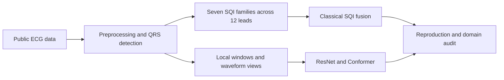

# ECG SQI Fusion

## Reproducing and extending classical ECG signal-quality assessment

This project asks whether classical signal-quality-index (SQI) fusion can be
functionally reproduced from public data, and what is lost when ECG quality is
compressed into whole-record summary features. It compares interpretable SQI
models with temporally local SQIs and waveform networks on 12-lead Set-A and
single-lead BUT QDB.

The repository is an open-science companion to the
[final report](report.md). It contains the analysis code, four frozen inference
models, tests, Docker definitions, and clean-room reproduction entry points.

## Main contribution

The classical fusion trend was recovered, but fixed synthetic class balancing
created an easily learned source shortcut. Train-only support-aware candidate
construction reduced that mismatch. Local SQIs improved the difficult
Good-Medium boundary, and waveform models retained additional local evidence
that fixed summaries discarded.

| Evidence | Result | Interpretation |
|---|---:|---|
| Reproduced five-SQI RBF-SVM accuracy | 0.948 | The strongest predefined paper subset was functionally reproduced. |
| Synthetic/native poor-source classifier AUC | 0.974 | Fixed synthetic poor records remained strongly distinguishable from native poor ECGs. |
| Poor recall at 95% acceptable specificity | 0.0759 to 0.7321 | Support-aware construction repaired most of the fixed-noise failure. |
| Set-A Full Conformer accuracy | 0.9128 | Best selected operating-point accuracy in the frozen Set-A comparison. |
| BUT Full Conformer macro-F1 | 0.9398 | Strong graded single-lead performance, but statistically comparable with matched ResNet. |

These values are taken from the submitted report. They are not claims of
clinical readiness; see [limitations](limitations.md).

## Read by goal

- **Understand the science:** [background](science_background.md),
  [methods](methods.md), and [findings](findings.md).
- **Run a model:** [five-minute quick start](quickstart.md) or
  [Docker inference](inference.md).
- **Reproduce the work:** [reproduction guide](reproduction.md) and
  [data contract](data_availability.md).
- **Use the code:** [model catalogue](models.md), [CLI reference](cli_reference.md),
  and [Python API](api_reference.md).

