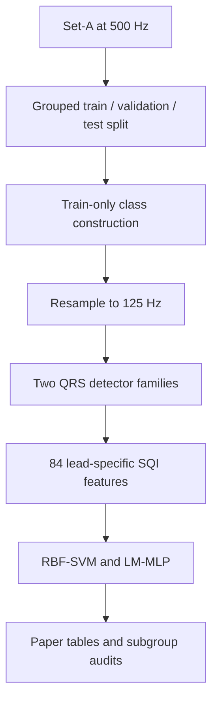

# Methods

## Classical reproduction

All 1,546 Set-A records pass through preprocessing, QRS detection, feature
construction, grouped splitting, and model evaluation. The paper-aligned path
uses `wqrs` and EP Limited/Hamilton detectors through
[`wfdb-qrs-kit`](wfdb_qrs_kit.md).

The work is a **functional reproduction**, not an exact replication. The
original adjudicated record- and lead-level labels were unavailable, so public
binary Set-A labels and a grouped frozen split were used. This distinction
limits the strength of direct paper-level claims.

## Poor-domain audit

The balanced unacceptable class contained 225 native poor and 548 synthetic
poor records. The audit evaluates:

1. PCA support overlap;
2. classifier two-sample tests in raw waveform and SQI space;
3. RBF maximum mean discrepancy;
4. directional transfer between native and generated poor sources;
5. source-stratified recall at frozen operating points.

This sequence distinguishes aggregate accuracy from genuine transfer to
naturally poor ECGs.

## Train-only support-aware construction

The extension builds a broader candidate bank using native morphology and
clean carriers, then applies donor, patient, severity, and support-bin
constraints. Sequential Monte Carlo (SMC) selects a balanced proposal set; a
constraint-matched random baseline tests whether improvement comes from the
candidate bank or from SMC itself.

<figure markdown="span">
  
  <figcaption>Candidate-type composition used by the support-aware construction. Validation and test remain native.</figcaption>
</figure>

## Local quality evidence

The representation comparison is hierarchical:

1. whole-record SQIs test global summary features;
2. local-window SQIs add temporal localisation;
3. waveform models preserve continuous morphology;
4. ResNet/Conformer and component controls test architecture attribution.

Aligned native BUT test rows and paired subject-level uncertainty are used for
the model contrasts. This makes the stable claim about representation, while
keeping the architecture-specific claim conditional on the dataset.

## Code mapping

The classical orchestration is exposed through
[`SQIPipelineConfig` and `run_pipeline`](api_reference.md#classical-pipeline-orchestration).
Frozen prediction uses the smaller, stable
[inference API](api_reference.md#inference-data-flow).
