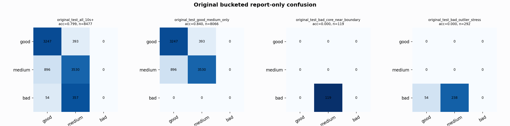

# Original Bucketed Checkpoint Report

Report-only evaluation. It is not used for Clean/SemiClean/node selection.

## Checkpoint

- Variant: `nl_n7155_gm_trim_bad_boundaryblocks_breakthrough_softbala_5c50f0ee6d7a`
- Prediction mode: `raw`

## Buckets

- `original_all_10s+`: n=32956, acc=0.8595, macro-F1=0.8723, recall good/medium/bad=0.8848/0.7946/0.9088
- `original_test_all_10s+`: n=8477, acc=0.7995, macro-F1=0.5465, recall good/medium/bad=0.8920/0.7976/0.0000
- `original_test_good_medium_only`: n=8066, acc=0.8402, macro-F1=0.5600, recall good/medium/bad=0.8920/0.7976/0.0000
- `original_test_bad_core_near_boundary`: n=119, acc=0.0000, macro-F1=0.0000, recall good/medium/bad=0.0000/0.0000/0.0000
- `original_test_bad_outlier_stress`: n=292, acc=0.0000, macro-F1=0.0000, recall good/medium/bad=0.0000/0.0000/0.0000
- `original_test_drop_bad_outlier_reference`: n=8185, acc=0.8280, macro-F1=0.5560, recall good/medium/bad=0.8920/0.7976/0.0000
- `original_test_good_medium_overlap`: n=7492, acc=0.8300, macro-F1=0.5532, recall good/medium/bad=0.8909/0.7735/0.0000
- `original_all_bad_core_near_boundary`: n=4084, acc=0.9706, macro-F1=0.3284, recall good/medium/bad=0.0000/0.0000/0.9706
- `original_all_bad_outlier_stress`: n=1201, acc=0.6986, macro-F1=0.2742, recall good/medium/bad=0.0000/0.0000/0.6986

## Counts

- Original all 10s+: `32956` windows.
- Original test 10s+: `8477` windows.
- Bad outlier stress is reported separately because dropping it removes most original-test bad windows.

