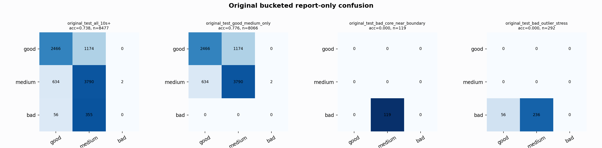

# Original Bucketed Checkpoint Report

Report-only evaluation. It is not used for Clean/SemiClean/node selection.

## Checkpoint

- Variant: `nl_n7160_gm_trim_bad_boundaryblocks_breakthrough_mediumgu_35ddcfe3c52a`
- Prediction mode: `medium_guarded_pmed001`

## Buckets

- `original_all_10s+`: n=32956, acc=0.8279, macro-F1=0.8500, recall good/medium/bad=0.7981/0.8352/0.9092
- `original_test_all_10s+`: n=8477, acc=0.7380, macro-F1=0.5012, recall good/medium/bad=0.6775/0.8563/0.0000
- `original_test_good_medium_only`: n=8066, acc=0.7756, macro-F1=0.5130, recall good/medium/bad=0.6775/0.8563/0.0000
- `original_test_bad_core_near_boundary`: n=119, acc=0.0000, macro-F1=0.0000, recall good/medium/bad=0.0000/0.0000/0.0000
- `original_test_bad_outlier_stress`: n=292, acc=0.0000, macro-F1=0.0000, recall good/medium/bad=0.0000/0.0000/0.0000
- `original_test_drop_bad_outlier_reference`: n=8185, acc=0.7643, macro-F1=0.5096, recall good/medium/bad=0.6775/0.8563/0.0000
- `original_test_good_medium_overlap`: n=7492, acc=0.7589, macro-F1=0.5040, recall good/medium/bad=0.6741/0.8375/0.0000
- `original_all_bad_core_near_boundary`: n=4084, acc=0.9709, macro-F1=0.3284, recall good/medium/bad=0.0000/0.0000/0.9709
- `original_all_bad_outlier_stress`: n=1201, acc=0.6994, macro-F1=0.2744, recall good/medium/bad=0.0000/0.0000/0.6994

## Counts

- Original all 10s+: `32956` windows.
- Original test 10s+: `8477` windows.
- Bad outlier stress is reported separately because dropping it removes most original-test bad windows.

