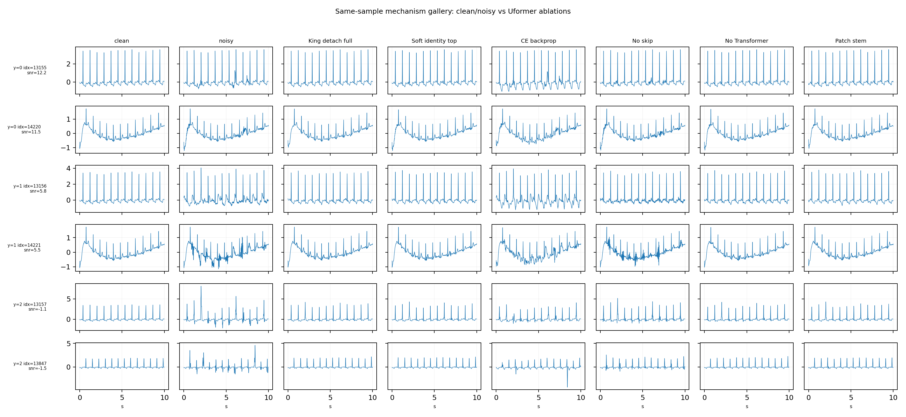

# E3.11f Uformer King Mechanism Ablation Results

## Summary

The follow-up ablation audit finished all 16 planned runs under `outputs/experiment/e311_sqi_denoise_classifier_grid/artifact/uformer_king_ablation_audit`.

The result supports the new mainline direction: a mature Transformer-based Uformer denoiser should be trained first, then a lightweight classifier should read detached/frozen denoiser-derived features. The most important finding is not just the higher score; it is that the negative controls fail in ways that match the intended mechanism.

## Main Results

| Run | Mechanism Tested | Acc | Good | Medium | Bad | Denoise Score | SNR Gain | Interpretation |
|---|---:|---:|---:|---:|---:|---:|---:|---|
| `c_repr_detach_full_tokens_morph_soft_identity` | softer identity-guard denoiser + detached full tokens | **0.99046** | 0.9864 | 0.9864 | **0.9986** | 4.202 | 12.086 | Best acc; denoise still strong, slightly less aggressive than king. |
| `a_repr_detach_full_tokens` | king denoiser + detached full tokens | 0.99001 | 0.9850 | **0.9891** | 0.9959 | **4.282** | **12.342** | Best balanced mechanism candidate; strongest proof for detached full-token representation. |
| `a_repr_detach_bottleneck_only` | bottleneck-only latent | 0.98774 | 0.9864 | 0.9850 | 0.9918 | **4.309** | **12.428** | Simpler candidate; close enough to justify a clean bottleneck ablation in promotion. |
| `a_repr_detach_summary_only` | noisy/denoised/residual summaries | 0.98819 | 0.9809 | 0.9864 | 0.9973 | 4.296 | 12.387 | Summaries are informative, but not sufficient alone to explain the model. |
| `a_repr_detach_residual_summary_only` | residual summary only | 0.56267 | 0.0000 | 0.7657 | 0.9223 | 4.280 | 12.337 | Strong negative control: not a residual-energy shortcut. |
| `a_repr_freeze_full_tokens` | frozen denoiser + full-token head | 0.98819 | 0.9877 | 0.9796 | 0.9973 | 3.998 | 11.452 | Freeze works; detach + mild denoise update works better. |
| `a_training_ce_backprop_full_tokens` | CE backprop through denoiser | 0.98592 | 0.9755 | 0.9850 | 0.9973 | **-3.121** | **-4.537** | Crucial negative control: CE can preserve classification while destroying denoise. |
| `b_repr_detach_full_tokens_uformer_no_skip` | no U-shaped decoder skip | 0.98229 | 0.9796 | 0.9714 | 0.9959 | 3.279 | 9.238 | Skip paths are needed for visual denoise fidelity and representation quality. |
| `b_repr_detach_full_tokens_uformer_patch_stem` | weaker patch stem | 0.98138 | 0.9823 | 0.9659 | 0.9959 | 4.088 | 11.717 | Denoise survives, but classifier representation weakens; local stem matters. |
| `b_repr_detach_full_tokens_uformer_no_transformer` | conv-only U-shaped control | 0.97866 | 0.9823 | 0.9646 | 0.9891 | 4.078 | 11.690 | Conv U-shape can denoise, but Transformer blocks improve class/SQI representation. |

## Denoiser Component Controls

| Denoiser Pretrain | Denoise Score | SNR Gain | MSE Ratio | Interpretation |
|---|---:|---:|---:|---|
| `b_denoise_uformer_no_skip_soft` | 3.037 | 8.516 | 0.1179 | Removing skips sharply weakens denoise. |
| `b_denoise_uformer_no_transformer_soft` | 3.808 | 10.836 | 0.0629 | Conv-only denoise is feasible, but downstream classification is worse. |
| `b_denoise_uformer_patch_stem_soft` | 3.705 | 10.520 | 0.0669 | Patch stem is viable but weaker than the full local stem. |
| `c_denoise_uformer_morph_clean_gdm` | 3.780 | 10.767 | 0.0616 | More morphology pressure works, but classification is not best. |
| `c_denoise_uformer_morph_soft_identity` | 3.968 | 11.337 | 0.0564 | Softer identity guard gives the best ablation classifier score. |

## Visual Audit

Same-sample mechanism grid:

Visual read:

- `King detach full` and `Soft identity top` both remove high-frequency/baseline corruption while preserving QRS-like sharp peaks.
- `CE backprop` is the clearest failure: classification remains high, but denoise visibly reintroduces distortion and metrics collapse.
- `No skip` leaves more residual artifacts and weaker morphology recovery.
- `No Transformer` denoises decently, but the classification head loses medium/bad separation, supporting Transformer tokens as the representation layer.
- `Patch stem` is visually acceptable, but weaker than the full local stem for classification.

## Mechanism Conclusion

The strongest interpretation is:

1. **Residual Uformer denoising is the right backbone.** It beats the earlier U-Net teacher on denoise metrics while keeping a Transformer-based architecture.
2. **Detached denoiser-derived tokens are the key classifier input.** Full tokens are best, bottleneck-only is close and cleaner, residual-only collapses.
3. **CE must not freely rewrite the denoiser.** The CE-backprop control is the strongest evidence: high acc can coexist with broken denoise, so detach/freeze is not an implementation detail; it is part of the mechanism.
4. **The architecture is not arbitrary.** Removing skips, removing Transformer blocks, or weakening the local stem each creates a distinct and explainable degradation.

## Mainline Candidate Recommendation

Use `a_repr_detach_full_tokens` as the primary mainline candidate unless simplicity is prioritized, in which case test `a_repr_detach_bottleneck_only` with seeds.

Recommended promotion shape:

`noisy ECG -> Conv local stem -> hierarchical Uformer encoder -> U-shaped residual-noise decoder -> denoise = noisy - scale * noise_hat -> detached Uformer tokens/summaries -> small MLP classifier`

Before promotion, run seed `0/1/2` for:

- `c_repr_detach_full_tokens_morph_soft_identity`
- `a_repr_detach_full_tokens`
- `a_repr_detach_bottleneck_only`

Also keep `a_training_ce_backprop_full_tokens`, `a_repr_detach_residual_summary_only`, `b_repr_detach_full_tokens_uformer_no_skip`, and `b_repr_detach_full_tokens_uformer_no_transformer` as permanent paper/report controls.

