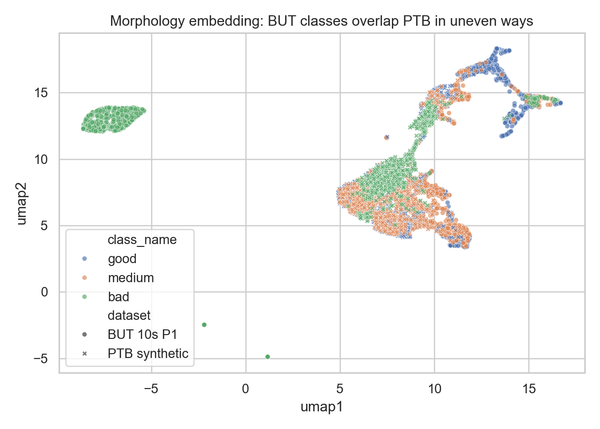
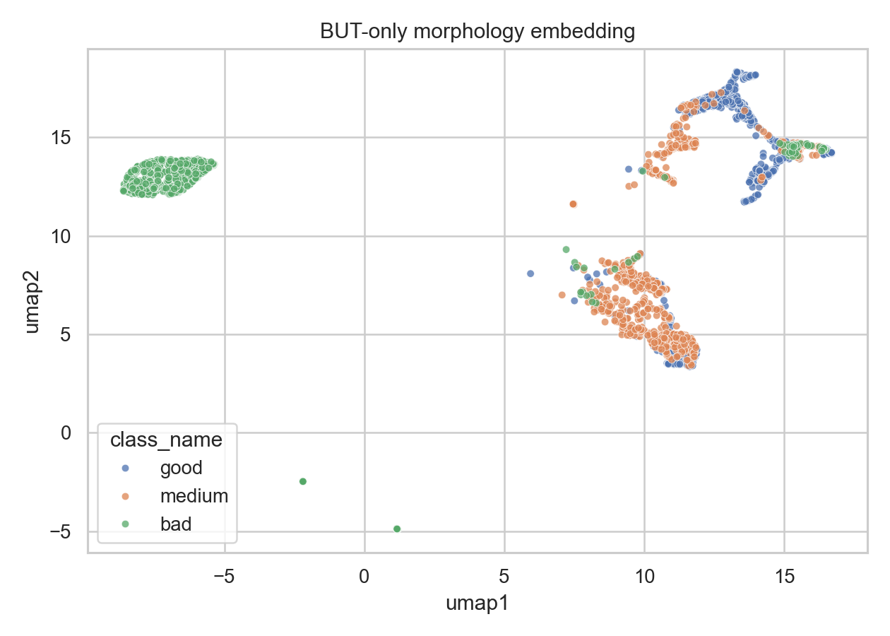
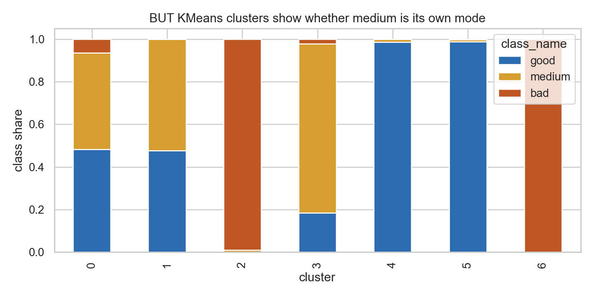
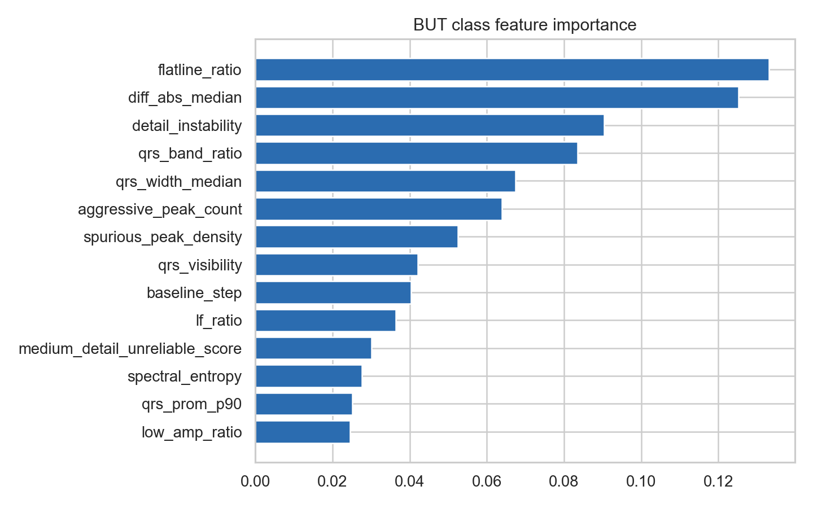
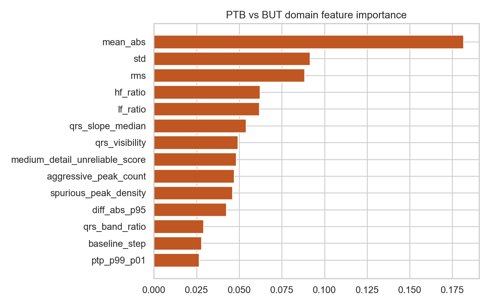
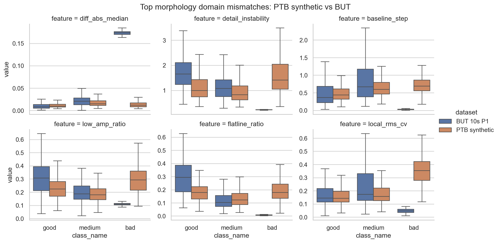
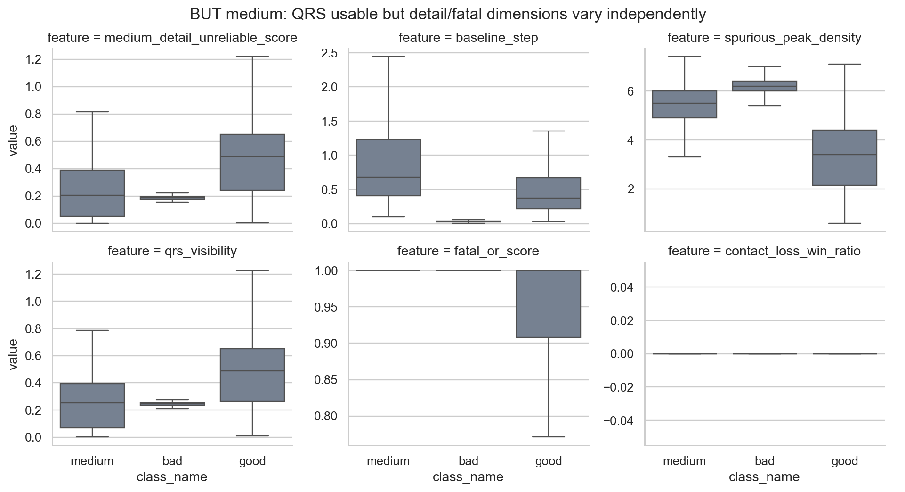
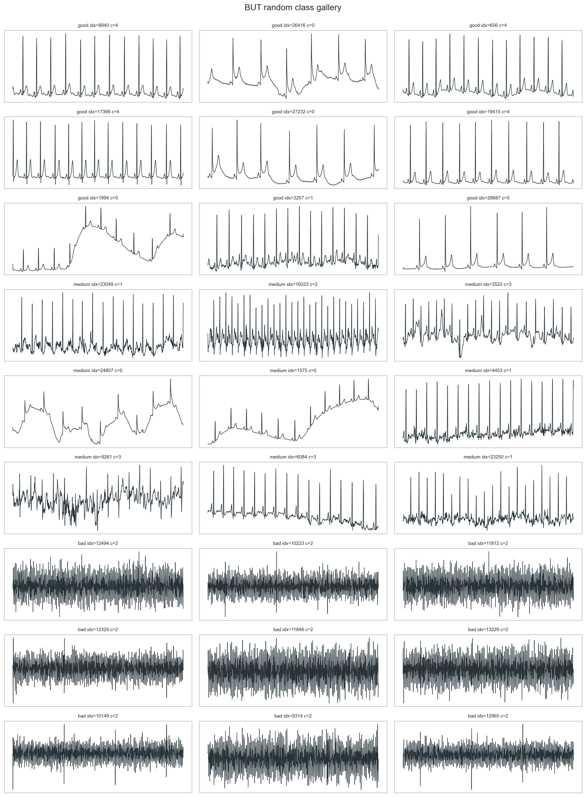

# BUT Morphology Cluster Analysis vs PTB Synthetic

## Executive Summary

- BUT good/medium/bad are separable from morphology/usability features with random-forest balanced accuracy `0.932`. This means there is real signal beyond label noise.
- PTB synthetic vs BUT is also highly separable with balanced accuracy `0.971`, so our generated data still carries a strong synthetic-domain fingerprint.
- Medium appears partly independent: the most medium-heavy clusters are [{'cluster': 3, 'share': 0.7936127744510978}, {'cluster': 1, 'share': 0.523726977248104}, {'cluster': 0, 'share': 0.4532967032967033}], not simply a clean interpolation between good and bad.
- The next generator should model bad as sample-level OR subtypes, while medium should preserve QRS visibility and vary local detail/P-T/ST/baseline reliability independently.

## Strongest BUT Class Features

flatline_ratio (0.133), diff_abs_median (0.125), detail_instability (0.090), qrs_band_ratio (0.083), qrs_width_median (0.067), aggressive_peak_count (0.064), spurious_peak_density (0.052), qrs_visibility (0.042)

## Strongest PTB-vs-BUT Domain Features

mean_abs (0.182), std (0.092), rms (0.088), hf_ratio (0.062), lf_ratio (0.062), qrs_slope_median (0.054), qrs_visibility (0.049), medium_detail_unreliable_score (0.048)

## Biggest Synthetic Mismatches

flatline_ratio/bad KS=0.93, diff_abs_median/bad KS=0.93, detail_instability/bad KS=0.93, local_rms_cv/bad KS=0.93, low_amp_ratio/bad KS=0.93, baseline_step/bad KS=0.92, lf_ratio/bad KS=0.92, qrs_width_median/bad KS=0.92

## Effect-Direction Flips

| feature | contrast | PTB effect | BUT effect | abs gap |
| --- | --- | ---: | ---: | ---: |
| diff_abs_median | bad_minus_medium | -0.262 | 4.152 | 4.413 |
| ptp_p99_p01 | bad_minus_good | 1.017 | -3.104 | 4.121 |
| rms | bad_minus_good | 0.891 | -3.108 | 3.999 |
| std | bad_minus_good | 0.910 | -3.025 | 3.936 |
| qrs_band_ratio | bad_minus_good | -1.979 | 1.874 | 3.853 |
| qrs_band_ratio | bad_minus_medium | -1.590 | 1.833 | 3.423 |
| low_amp_ratio | bad_minus_good | 0.814 | -2.102 | 2.916 |
| ptp_p99_p01 | bad_minus_medium | 0.923 | -1.943 | 2.866 |

## Figures

## Output Tables

- Local output root: `outputs\external_benchmarks\e311_but_morphology_cluster_analysis_10s_2026_06_04`
- `morph_feature_summary.csv`
- `morph_domain_distance.csv`
- `morph_effect_alignment.csv`
- `but_cluster_composition.csv`
- `but_rf_importance.csv` and `domain_rf_importance.csv`
