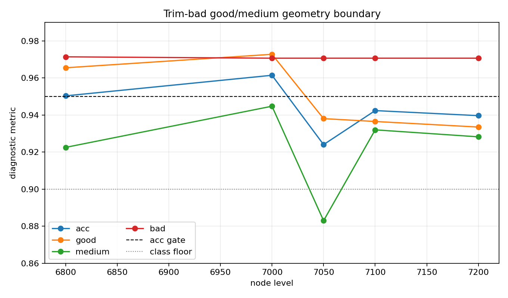

# Good/Medium Geometry Boundary Bisection

Selection uses Clean/SemiClean/node diagnostic only. Original BUT remains report-only.

| level | acc | good | medium | bad | good->medium | medium->good | promoted | best variant |
|---:|---:|---:|---:|---:|---:|---:|:---:|---|
| 6800 | 0.950294 | 0.965441 | 0.922500 | 0.971352 |  |  | yes | `nl_n6800_gm_trim_bad_scan_029_sc_overlap_narrow_oscillato_873d37fc4791` |
| 7000 | 0.961402 | 0.972714 | 0.944714 | 0.970617 |  |  | yes | `nl_n7000_gm_trim_bad_geom_pc1flat_g030_m038_g126_m168_b15_9160023afe86` |
| 7050 | 0.923999 | 0.938014 | 0.882979 | 0.970617 | 437 | 825 | no | `nl_n7050_gm_trim_bad_geom_pc1flat_g018_m026_g122_m170_b15_98a5e745864d` |
| 7100 | 0.942354 | 0.936479 | 0.931972 | 0.970617 | 451 | 483 | no | `nl_n7100_gm_trim_bad_geom_pc1flat_g030_m038_g126_m168_b15_7ff4e49ac675` |
| 7200 | 0.939623 | 0.933472 | 0.928194 | 0.970617 | 479 | 517 | no | `nl_n7200_gm_trim_bad_geom_tri_atlaspc2_matchold_g002_m006_942f7f261b19` |

## Current Reading

- N7000 is the largest promoted boundary so far and is stronger than N6800 on acc/good/medium while keeping bad stable.
- N7050 and N7100 do not promote. N7100 is better than N7050, so the failure is not a simple monotonic node-size issue; it depends on geometry config and sampled overlap composition.
- N7200 match-old tri-band improves over the older N7200 baseline but still stays below the acc gate, with nearly symmetric good/medium confusion.
- Next useful work should analyze N7000-promoted vs N7100-best overlap composition and tune N7100 locally, rather than continuing broad N7200 sweeps.
