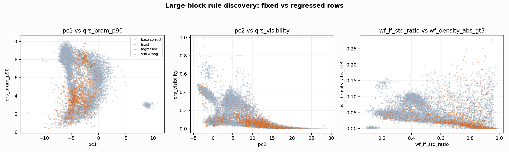

# Large Block Rule Discovery

Report-only original-test analysis. The goal is to test whether a few broad ECG/SQI axes can recover large error blocks without accumulating many tiny exceptions.

## Baseline

- Source predictions: `E:\GPTProject2\ecg\outputs\external_benchmarks\e311_but_node_ladder_tuning_10s_2026_06_08\analysis\original_bucketed_checkpoint\nl_n7200_gm_trim_bad_goodlike_aux_tai_acecb57de1__feature_pc1_qrsprom_visiblegood_w_d679dd16_original_test_predictions.csv`
- Acc=0.908104, macro-F1=0.839910, recall good/medium/bad=0.908242/0.933800/0.630170

## Greedy Broad-Rule Result

- Acc=0.910228, macro-F1=0.847387, recall good/medium/bad=0.908242/0.934026/0.671533

Chosen rules:
- Step 1: `nonbad_to_bad` if `template_corr <= 0.286416 AND wf_spike_interval_cv >= 4.71424` (net fixed 6, acc 0.908812)
- Step 2: `good_to_medium` if `qrs_visibility <= 0.0545128 AND template_corr <= 0.417897` (net fixed 4, acc 0.909284)
- Step 3: `medium_to_good` if `low_amp_ratio >= 0.2976 AND wf_power_0_3 <= 0.0840666` (net fixed 4, acc 0.909756)
- Step 4: `good_to_medium` if `mean_abs >= 0.147495 AND sqi_bSQI >= 0.909091` (net fixed 4, acc 0.910228)

## Top Medium -> Good Rescue Candidates

| condition | acc | macro_f1 | good_recall | medium_recall | bad_recall | selected_n | fixed_n | regressed_n | net_fixed |
| --- | --- | --- | --- | --- | --- | --- | --- | --- | --- |
| fatal_or_score <= 0.65 AND detector_agreement <= 0.168873 | 0.908694 | 0.840333 | 0.910714 | 0.932897 | 0.630170 | 26 | 9 | 4 | 5 |
| low_amp_ratio >= 0.2976 AND wf_power_0_3 <= 0.0840666 | 0.908576 | 0.840247 | 0.909615 | 0.933574 | 0.630170 | 9 | 5 | 1 | 4 |
| wf_diff_ratio_99_95 >= 10.9653 AND mean_abs >= 0.158176 | 0.908340 | 0.840081 | 0.909615 | 0.933122 | 0.630170 | 21 | 5 | 3 | 2 |
| wf_abs_ratio_99_95 >= 5.54291 AND wf_power_0_3 <= 0.0840666 | 0.908340 | 0.840080 | 0.909341 | 0.933348 | 0.630170 | 6 | 4 | 2 | 2 |
| std >= 0.316448 AND wf_power_0_3 <= 0.0840666 | 0.908340 | 0.840080 | 0.909341 | 0.933348 | 0.630170 | 6 | 4 | 2 | 2 |
| wf_diff_ratio_99_95 >= 10.9653 AND low_amp_ratio <= 0.063904 | 0.908340 | 0.840078 | 0.908791 | 0.933800 | 0.630170 | 18 | 2 | 0 | 2 |
| wf_diff_ratio_99_95 >= 10.9653 AND wf_autocorr_beatiness <= 0.0100589 | 0.908222 | 0.839999 | 0.909890 | 0.932671 | 0.630170 | 1405 | 6 | 5 | 1 |
| wf_abs_ratio_99_95 >= 5.54291 AND wf_autocorr_beatiness <= 0.0100589 | 0.908222 | 0.839996 | 0.909066 | 0.933348 | 0.630170 | 107 | 3 | 2 | 1 |
| wf_diff_ratio_99_95 >= 10.9653 AND non_qrs_diff_p95 <= 0.00943061 | 0.908222 | 0.839994 | 0.908516 | 0.933800 | 0.630170 | 13 | 1 | 0 | 1 |
| wf_diff_ratio_99_95 >= 10.9653 AND wf_abs_p95 <= 1.45494 | 0.908222 | 0.839994 | 0.908516 | 0.933800 | 0.630170 | 12 | 1 | 0 | 1 |
| flatline_ratio >= 0.590873 AND wf_diff_ratio_99_95 >= 9.45139 | 0.908222 | 0.839994 | 0.908516 | 0.933800 | 0.630170 | 6 | 1 | 0 | 1 |
| low_amp_ratio >= 0.2976 AND wf_power_3_8 >= 0.305054 | 0.908104 | 0.839915 | 0.909615 | 0.932671 | 0.630170 | 128 | 5 | 5 | 0 |

## Top Good -> Medium Guard Candidates

| condition | acc | macro_f1 | good_recall | medium_recall | bad_recall | selected_n | fixed_n | regressed_n | net_fixed |
| --- | --- | --- | --- | --- | --- | --- | --- | --- | --- |
| qrs_visibility <= 0.0545128 AND template_corr <= 0.417897 | 0.908576 | 0.840273 | 0.906868 | 0.935834 | 0.630170 | 1179 | 9 | 5 | 4 |
| template_corr <= 0.417897 AND non_qrs_diff_p95 >= 0.0586806 | 0.908576 | 0.840249 | 0.907967 | 0.934930 | 0.630170 | 596 | 5 | 1 | 4 |
| mean_abs >= 0.147495 AND sqi_bSQI >= 0.909091 | 0.908576 | 0.840241 | 0.908242 | 0.934704 | 0.630170 | 134 | 4 | 0 | 4 |
| non_qrs_diff_p95 >= 0.0586806 AND qrs_visibility <= 0.0638114 | 0.908576 | 0.840238 | 0.907418 | 0.935382 | 0.630170 | 612 | 7 | 3 | 4 |
| non_qrs_diff_p95 >= 0.0586806 AND mean_abs >= 0.147495 | 0.908458 | 0.840159 | 0.908242 | 0.934478 | 0.630170 | 361 | 3 | 0 | 3 |
| sqi_bSQI >= 0.909091 AND wf_abs_p95 <= 1.67665 | 0.908458 | 0.840159 | 0.908242 | 0.934478 | 0.630170 | 21 | 3 | 0 | 3 |
| mean_abs >= 0.147495 AND pc3 >= 2.99423 | 0.908458 | 0.840155 | 0.907418 | 0.935156 | 0.630170 | 225 | 6 | 3 | 3 |
| qrs_band_ratio <= 0.156331 AND mean_abs >= 0.147495 | 0.908340 | 0.840085 | 0.908242 | 0.934252 | 0.630170 | 131 | 2 | 0 | 2 |
| mean_abs >= 0.147495 AND wf_power_0_3 >= 0.587821 | 0.908340 | 0.840085 | 0.908242 | 0.934252 | 0.630170 | 40 | 2 | 0 | 2 |
| mean_abs >= 0.147495 AND qrs_visibility <= 0.0638114 | 0.908340 | 0.840077 | 0.906319 | 0.935834 | 0.630170 | 327 | 9 | 7 | 2 |
| qrs_visibility <= 0.0638114 AND sqi_bSQI >= 0.909091 | 0.908340 | 0.840076 | 0.908242 | 0.934252 | 0.630170 | 49 | 2 | 0 | 2 |
| template_corr <= 0.417897 AND wf_density_abs_gt2 <= 0.0264 | 0.908340 | 0.840075 | 0.907967 | 0.934478 | 0.630170 | 271 | 3 | 1 | 2 |

## Top Non-Bad -> Bad Stress Candidates

| condition | acc | macro_f1 | good_recall | medium_recall | bad_recall | selected_n | fixed_n | regressed_n | net_fixed |
| --- | --- | --- | --- | --- | --- | --- | --- | --- | --- |
| template_corr <= 0.286416 AND wf_spike_interval_cv >= 4.71424 | 0.908812 | 0.846372 | 0.908242 | 0.931315 | 0.671533 | 59 | 17 | 11 | 6 |
| wf_power_0_3 >= 0.651697 AND wf_autocorr_peak <= 0.191965 | 0.908458 | 0.843059 | 0.908242 | 0.932671 | 0.649635 | 43 | 8 | 5 | 3 |
| wf_spike_interval_cv >= 4.71424 AND wf_autocorr_peak <= 0.191965 | 0.908458 | 0.842025 | 0.908242 | 0.933348 | 0.642336 | 32 | 5 | 2 | 3 |
| template_corr <= 0.286416 AND mean_abs <= 0.103092 | 0.908340 | 0.842197 | 0.908242 | 0.932897 | 0.644769 | 33 | 6 | 4 | 2 |
| template_corr <= 0.286416 AND wf_power_0_3 >= 0.651697 | 0.908222 | 0.844180 | 0.908242 | 0.930637 | 0.666667 | 48 | 15 | 14 | 1 |
| sqi_sSQI <= -1.09254 AND wf_autocorr_peak <= 0.191965 | 0.908222 | 0.843185 | 0.908242 | 0.931315 | 0.659367 | 53 | 12 | 11 | 1 |
| wf_skew <= -1.09123 AND wf_autocorr_peak <= 0.191965 | 0.908222 | 0.843185 | 0.908242 | 0.931315 | 0.659367 | 53 | 12 | 11 | 1 |
| wf_autocorr_peak <= 0.191965 AND mean_abs <= 0.103092 | 0.908222 | 0.841317 | 0.907692 | 0.933574 | 0.639903 | 23 | 4 | 3 | 1 |
| template_corr <= 0.286416 AND wf_autocorr_peak <= 0.191965 | 0.908222 | 0.840521 | 0.908242 | 0.933800 | 0.632603 | 81 | 1 | 0 | 1 |
| wf_autocorr_peak <= 0.191965 AND rms <= 0.153791 | 0.908222 | 0.840521 | 0.908242 | 0.933800 | 0.632603 | 6 | 1 | 0 | 1 |
| wf_autocorr_peak <= 0.191965 AND std <= 0.151771 | 0.908222 | 0.840521 | 0.908242 | 0.933800 | 0.632603 | 6 | 1 | 0 | 1 |
| flatline_ratio >= 0.540584 AND wf_autocorr_peak <= 0.191965 | 0.908104 | 0.840191 | 0.908242 | 0.933574 | 0.632603 | 27 | 1 | 1 | 0 |

## Fixed/Regressed Blocks

| state | record_id | class_name | original_region | pred_class | new_pred_class | n |
| --- | --- | --- | --- | --- | --- | --- |
| fixed | 111001 | bad | outlier_low_confidence | medium | bad | 15 |
| fixed | 111001 | medium | outlier_low_confidence | good | medium | 11 |
| fixed | 111001 | bad | outlier_low_confidence | good | bad | 2 |
| fixed | 111001 | good | good_medium_overlap | medium | good | 2 |
| fixed | 111001 | medium | good_medium_overlap | good | medium | 2 |
| fixed | 122001 | good | good_medium_overlap | medium | good | 2 |
| fixed | 111001 | good | outlier_low_confidence | medium | good | 1 |
| regressed | 111001 | medium | outlier_low_confidence | medium | bad | 11 |
| regressed | 111001 | good | outlier_low_confidence | good | medium | 3 |
| regressed | 111001 | good | good_medium_overlap | good | medium | 2 |
| regressed | 111001 | medium | good_medium_overlap | medium | good | 1 |
| still_wrong | 111001 | good | outlier_low_confidence | medium | medium | 204 |
| still_wrong | 111001 | medium | outlier_low_confidence | good | good | 177 |
| still_wrong | 111001 | bad | outlier_low_confidence | medium | medium | 125 |
| still_wrong | 111001 | medium | outlier_low_confidence | bad | bad | 79 |
| still_wrong | 125001 | good | outlier_low_confidence | medium | medium | 70 |
| still_wrong | 111001 | good | good_medium_overlap | medium | medium | 39 |
| still_wrong | 111001 | medium | good_medium_overlap | good | good | 23 |
| still_wrong | 111001 | good | outlier_low_confidence | bad | bad | 10 |
| still_wrong | 111001 | bad | outlier_low_confidence | good | good | 8 |
| still_wrong | 125001 | good | good_medium_overlap | medium | medium | 5 |
| still_wrong | 111001 | bad | outlier_low_confidence | good | medium | 2 |
| still_wrong | 111001 | medium | good_medium_overlap | bad | bad | 1 |
| still_wrong | 122001 | good | good_medium_overlap | medium | medium | 1 |

## Interpretation
- Use this as a diagnostic search for broad axes, not as a promoted classifier.
- A useful breakthrough should improve a large block with small regression and remain expressible as one or two ECG morphology/SQI axes.
