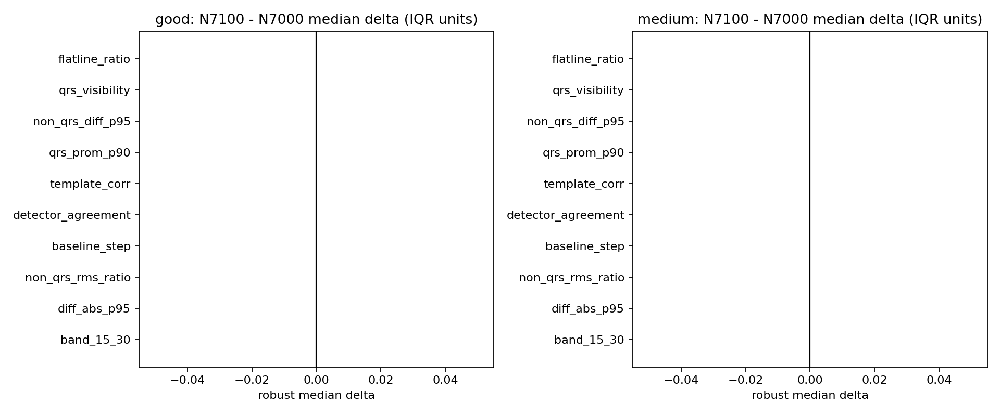

# N7000 vs N7100 Overlap Composition

This compares the synthetic auxiliary rows selected for the promoted N7000 geometry variant and the best N7100 geometry variant. It does not use original BUT for selection.

## Top Good Feature Shifts

| feature | N7000 med | N7100 med | robust delta |
|---|---:|---:|---:|
| flatline_ratio | 0.4908 | 0.4908 | 0.000 |
| qrs_visibility | 0.7566 | 0.7566 | 0.000 |
| non_qrs_diff_p95 | 0.01167 | 0.01167 | 0.000 |
| qrs_prom_p90 | 6.389 | 6.389 | 0.000 |
| template_corr | 0.7615 | 0.7615 | 0.000 |
| detector_agreement | 0.4142 | 0.4142 | 0.000 |
| baseline_step | 0.3503 | 0.3503 | 0.000 |
| non_qrs_rms_ratio | 0.141 | 0.141 | 0.000 |

## Top Medium Feature Shifts

| feature | N7000 med | N7100 med | robust delta |
|---|---:|---:|---:|
| flatline_ratio | 0.05124 | 0.05124 | 0.000 |
| qrs_visibility | 0.2309 | 0.2309 | 0.000 |
| non_qrs_diff_p95 | 0.2113 | 0.2113 | 0.000 |
| qrs_prom_p90 | 5.904 | 5.904 | 0.000 |
| template_corr | 0.5505 | 0.5505 | 0.000 |
| detector_agreement | 0.445 | 0.445 | 0.000 |
| baseline_step | 0.4586 | 0.4586 | 0.000 |
| non_qrs_rms_ratio | 0.4702 | 0.4702 | 0.000 |

## Reading

- N7100 uses the same geometry recipe as promoted N7000 but at a larger boundary. The failure therefore points to the local overlap manifold not being sufficiently covered, not bad collapse.
- Compare feature deltas with the confusion pattern: N7100 best is balanced but under the acc gate, while N7050 became medium-heavy. The next experiment should tune N7100 locally with a smaller, more stable paired auxiliary set rather than broad N7200 sweeps.
- Bad remains a guardrail; original bucketed metrics remain report-only.
