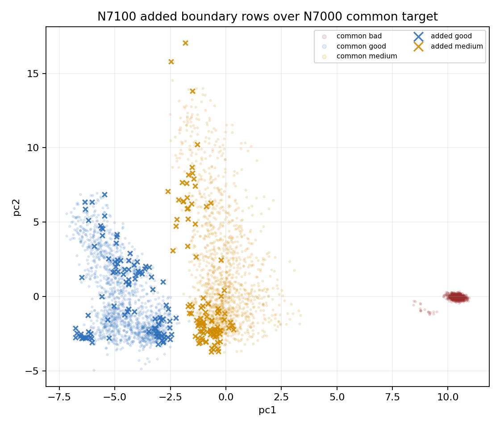

# N7100 Added Boundary Analysis

This analyzes rows selected by N7100_gm_trim_bad but not by N7000_gm_trim_bad. Original BUT is not used.

Selected N7000: 18084; selected N7100: 18284; common: 18084; added: 200; dropped: 0.

## Added Class Counts

| class | added n | rate |
|---|---:|---:|
| good | 100 | 0.500 |
| medium | 100 | 0.500 |

## Added Region Counts

| region | added n | rate |
|---|---:|---:|
| good_medium_overlap | 160 | 0.800 |
| clean_core | 20 | 0.100 |
| outlier_low_confidence | 20 | 0.100 |

## Good: Added vs Common Feature Gaps

| feature | added med | common med | robust delta |
|---|---:|---:|---:|
| pca_margin | 1.929 | 2.622 | -0.789 |
| boundary_confidence | 0.6582 | 0.7667 | -0.648 |
| pc3 | 0.3056 | -1.272 | 0.647 |
| qrs_visibility | 0.4139 | 0.5792 | -0.471 |
| pc4 | 1.788 | 0.2605 | 0.342 |
| detector_agreement | 0.2685 | 0.3274 | -0.315 |
| non_qrs_rms_ratio | 0.2497 | 0.2969 | -0.255 |
| diff_abs_p95 | 0.1232 | 0.1554 | -0.228 |
| mean_abs | 0.1277 | 0.1319 | -0.222 |
| pc1 | -4.384 | -4.777 | 0.217 |

## Medium: Added vs Common Feature Gaps

| feature | added med | common med | robust delta |
|---|---:|---:|---:|
| pca_margin | 1.369 | 2.465 | -0.994 |
| pc1 | -1.018 | -0.1556 | -0.750 |
| boundary_confidence | 0.5316 | 0.7317 | -0.710 |
| rms | 0.2673 | 0.2192 | 0.654 |
| std | 0.2627 | 0.2165 | 0.647 |
| amplitude_entropy | 0.6609 | 0.7153 | -0.545 |
| ptp_p99_p01 | 1.66 | 1.347 | 0.531 |
| non_qrs_rms_ratio | 0.368 | 0.4933 | -0.529 |
| pc3 | 1.364 | 2.338 | -0.520 |
| sqi_kSQI | 19.51 | 14.21 | 0.491 |

## Reading

- The N7000 and N7100 geometry variants used the same auxiliary recipe; the failure is from the newly admitted boundary rows.
- If added rows are mostly medium/outlier-low-confidence or shifted in PC/flatline/QRS dimensions, the next generator should target those added rows specifically instead of increasing global good/medium weights.
- Bad remains stable and should stay a guardrail, not the optimization target.
