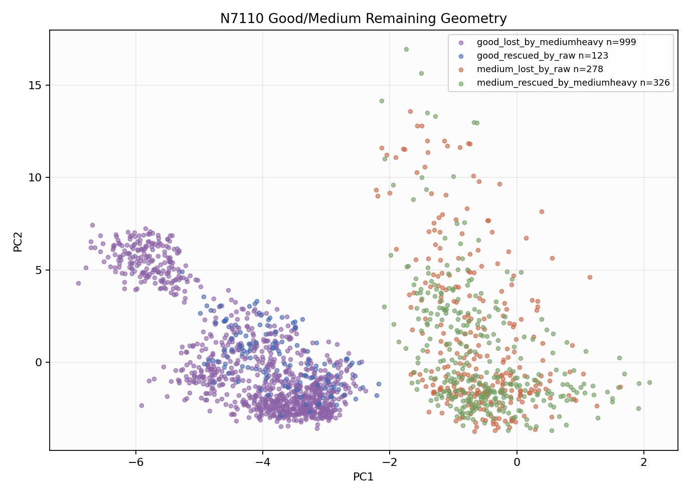

# N7110 Geometry Disagreement

N7110 did not promote, so this report isolates the remaining good/medium mutual-eating geometry.
Balanced endpoint is the best diagnostic mode. Good-raw removes the medium guard from the same variant; medium-heavy is the most medium-forward quick endpoint.

## Model Endpoints

- `balanced`: acc 0.9462, macro-F1 0.9518, recall good/medium/bad 0.9713/0.9070/0.9709
- `good_raw_endpoint`: acc 0.9378, macro-F1 0.9444, recall good/medium/bad 0.9886/0.8679/0.9709
- `medium_heavy_endpoint`: acc 0.9055, macro-F1 0.9170, recall good/medium/bad 0.8315/0.9422/0.9706

## Disagreement Counts

- `other`: 16578
- `good_lost_by_mediumheavy`: 999
- `medium_rescued_by_mediumheavy`: 326
- `medium_lost_by_raw`: 278
- `good_rescued_by_raw`: 123

## Refine Target Rows

- rows: 1726
- class_counts: {'good': 1122, 'medium': 604}
- group_counts: {'good_lost_by_mediumheavy': 999, 'medium_rescued_by_mediumheavy': 326, 'medium_lost_by_raw': 278, 'good_rescued_by_raw': 123}

## Good-Raw Separator Features

- `pc1` KS 0.993, good-rescued/medium-lost med -3.797/-0.6594
- `pc3` KS 0.924, good-rescued/medium-lost med -1.825/2.909
- `qrs_visibility` KS 0.921, good-rescued/medium-lost med 0.602/0.2193
- `flatline_ratio` KS 0.877, good-rescued/medium-lost med 0.285/0.09768
- `template_corr` KS 0.810, good-rescued/medium-lost med 0.7216/0.5343
- `non_qrs_diff_p95` KS 0.700, good-rescued/medium-lost med 0.04693/0.1044
- `band_30_45` KS 0.569, good-rescued/medium-lost med 0.01586/0.02629
- `knn_label_purity` KS 0.505, good-rescued/medium-lost med 1/0.9

## Medium-Heavy Separator Features

- `pc1` KS 1.000, medium-rescued/good-lost med -0.708/-3.93
- `pc3` KS 0.960, medium-rescued/good-lost med 3.315/-1.169
- `flatline_ratio` KS 0.916, medium-rescued/good-lost med 0.09247/0.2626
- `template_corr` KS 0.816, medium-rescued/good-lost med 0.5323/0.6588
- `qrs_visibility` KS 0.745, medium-rescued/good-lost med 0.1719/0.6199
- `non_qrs_diff_p95` KS 0.731, medium-rescued/good-lost med 0.1151/0.05305
- `knn_label_purity` KS 0.657, medium-rescued/good-lost med 0.8333/1
- `boundary_confidence` KS 0.460, medium-rescued/good-lost med 0.6365/0.7631

