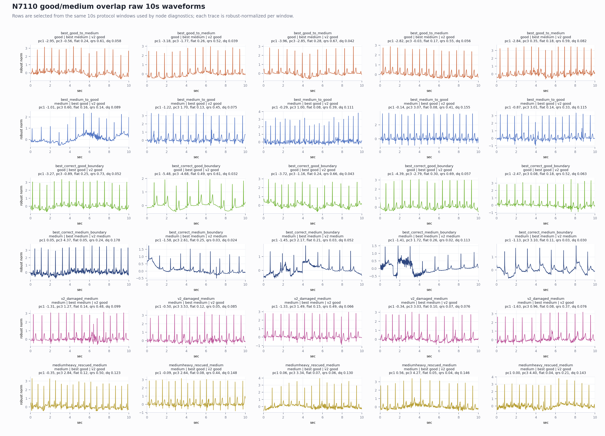
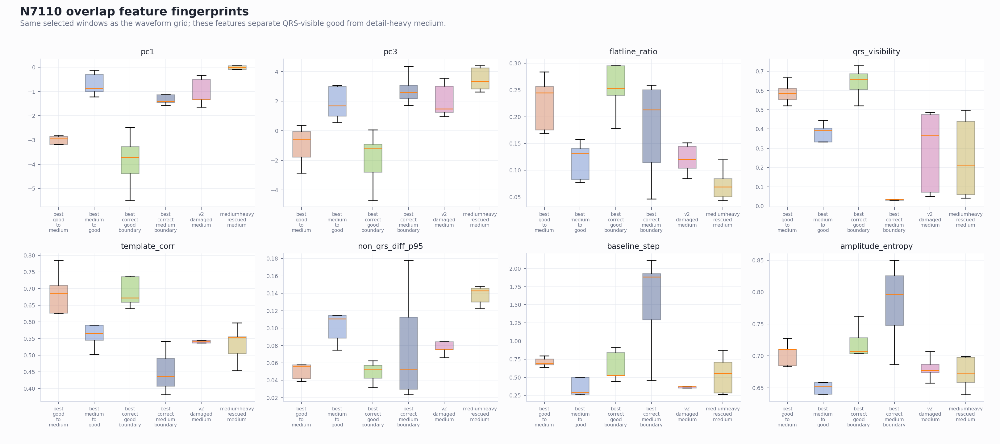

# N7110 Good/Medium Overlap Waveform Report

This report uses raw 10s windows from the same protocol used by node diagnostics. It focuses on the local good/medium boundary, not global averages.

## What The Raw Waveforms Show

- `best_good_to_medium`: good rows that the current best N7110 sends to medium. They tend to keep visible QRS structure but sit near the contaminated boundary.
- `best_medium_to_good`: medium rows that the current best sends to good. They tend to have less negative PC1, higher PC3, weaker QRS/template agreement, and more non-QRS high-detail content.
- `v2_damaged_medium`: medium rows that were correct under the best model but became good under the latest medium-rescue v2. These are the rows explaining why that retry moved the wrong way.

## Held-Out Geometry Gate Check

The gate below is report-only. Thresholds are searched on train+val rows and evaluated on held-out test rows.

- base all-node acc 0.9462, good/medium/bad recall 0.9713/0.9070/0.9709
- base test acc 0.9113, good/medium/bad recall 0.9964/0.9077/0.0000
- train+val acc 0.9948, good/medium/bad recall 0.9914/0.9946/1.0000
- test acc 0.9448, good/medium/bad recall 0.9978/0.9607/0.0000
- all-node acc 0.9840, good/medium/bad recall 0.9927/0.9828/0.9709
- thresholds: pc1 <= -2.527 and pc3 <= 0.9236 for good rescue; medium rescue uses the opposite side with flatline < 0.1585, qrs_visibility < 0.527, non_qrs_diff_p95 > 0.06899
- caution: the test split has 119 bad rows and the base model already misses them; this gate is a good/medium rule probe, not a standalone bad validation.

## Top Feature Gaps

### Current best errors: good->medium vs medium->good
- `pc1` KS 0.991, medians best_good_to_medium=-3.657, best_medium_to_good=-0.6974
- `pc3` KS 0.959, medians best_good_to_medium=-1.808, best_medium_to_good=2.97
- `flatline_ratio` KS 0.902, medians best_good_to_medium=0.2826, best_medium_to_good=0.09367
- `qrs_visibility` KS 0.926, medians best_good_to_medium=0.5978, best_medium_to_good=0.238
- `template_corr` KS 0.883, medians best_good_to_medium=0.7226, best_medium_to_good=0.5457
- `non_qrs_diff_p95` KS 0.792, medians best_good_to_medium=0.04405, best_medium_to_good=0.1119
- `band_30_45` KS 0.730, medians best_good_to_medium=0.01574, best_medium_to_good=0.03003
- `amplitude_entropy` KS 0.700, medians best_good_to_medium=0.7222, best_medium_to_good=0.6353

### Failed v2 damage: damaged medium vs medium-heavy rescued medium
- `non_qrs_rms_ratio` KS 0.318, medians v2_damaged_medium=0.4433, mediumheavy_rescued_medium=0.3593
- `band_30_45` KS 0.313, medians v2_damaged_medium=0.02951, mediumheavy_rescued_medium=0.02276
- `pc3` KS 0.267, medians v2_damaged_medium=2.791, mediumheavy_rescued_medium=3.315
- `sqi_sSQI` KS 0.285, medians v2_damaged_medium=3.569, mediumheavy_rescued_medium=3.867
- `sqi_kSQI` KS 0.250, medians v2_damaged_medium=19.16, mediumheavy_rescued_medium=21.01
- `template_corr` KS 0.233, medians v2_damaged_medium=0.5561, mediumheavy_rescued_medium=0.5323
- `band_15_30` KS 0.249, medians v2_damaged_medium=0.2578, mediumheavy_rescued_medium=0.2447
- `boundary_confidence` KS 0.211, medians v2_damaged_medium=0.6988, mediumheavy_rescued_medium=0.6365

## Interpretation

The stable distinction is not simply 'more medium samples'. The medium rows we must protect are the PC1-less-negative / PC3-high / lower-QRS-visibility / higher non-QRS-detail side. The good rows worth rescuing are PC1-low / PC3-low / flatter / visibly-QRS rows. The failed v2 retry damaged medium because it did not enforce this two-sided geometry strongly enough during training conversion.
