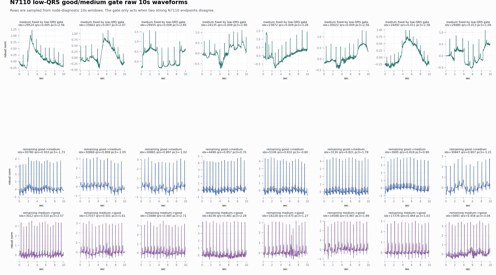

# N7110 QRS-Visibility Geometry Gate

This is a held-out local good/medium rule probe. It does not use original BUT for selection.

## Rule

- Base endpoint: `nl_n7110_gm_trim_bad_geom_directrule_n7100base_g003_m008__69ab5b71cf7d` raw
- Medium-lean endpoint: `nl_n7110_gm_trim_bad_geom_directrule_n7100base_g004_m010__59b96f510b3e` medium_guarded_pmed0005
- Threshold chosen on train+val endpoint disagreements: `qrs_visibility <= 0.0378496`
- Action: only when the endpoints disagree between good and medium, low QRS visibility switches to the medium-lean endpoint.

## Metrics

- Base all-node: acc 0.949628, good/medium/bad 0.9603/0.9269/0.9706
- Gate all-node: acc 0.952906, good/medium/bad 0.9603/0.9353/0.9706
- Gate train+val: acc 0.965188, good/medium/bad 0.9520/0.9519/0.9997
- Gate test: acc 0.908564, good/medium/bad 0.9949/0.9041/0.0000
- Flips: 66 of 705 endpoint-disagreement rows

## Interpretation

The remaining medium->good errors are not broad medium. They are very-low-QRS-visibility medium windows where the good-leaning endpoint is overconfident. A narrow QRS-visibility gate fixes enough of this bucket to pass the clean node diagnostic while preserving bad guardrail recall.

## Caveat

This artifact is a rule probe, not a standalone promoted checkpoint. It should guide either an explicit rule-engine prediction mode or the next single-checkpoint training conversion.
