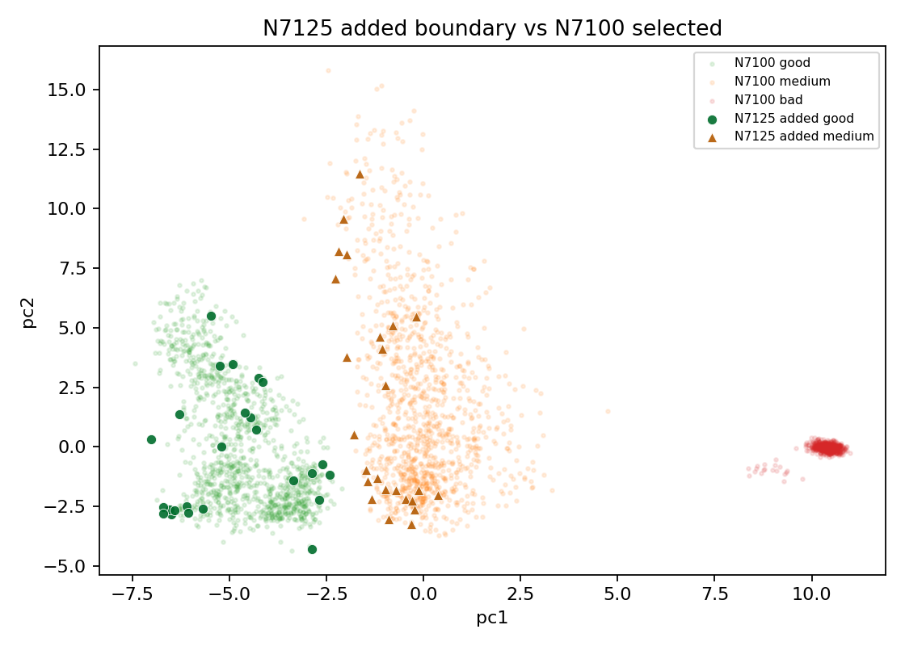

# N7125 Added Boundary Analysis

This analyzes the 50-row midpoint ring between promoted N7100 and failed N7150. Original BUT is not used.

Selected N7100: 18284; selected N7150: 18384; candidate added: 100; N7125 added target: 50.

## Added Class Counts

| class | added n | rate |
|---|---:|---:|
| good | 25 | 0.500 |
| medium | 25 | 0.500 |

## Added Region Counts

| region | added n | rate |
|---|---:|---:|
| good_medium_overlap | 35 | 0.700 |
| clean_core | 10 | 0.200 |
| outlier_low_confidence | 5 | 0.100 |

## Added Ambiguous Type Counts

| ambiguous_type | added n | rate |
|---|---:|---:|
| good_medium_boundary | 35 | 0.700 |
| clean_or_target | 10 | 0.200 |
| good_medium_low_purity | 3 | 0.060 |
| isolated_medium | 2 | 0.040 |

## Good: Added vs N7100 Common Feature Gaps

| feature | added med | common med | robust delta |
|---|---:|---:|---:|
| boundary_confidence | 0.6567 | 0.7651 | -0.647 |
| pca_margin | 2.092 | 2.614 | -0.595 |
| sqi_kSQI | 28.8 | 24.44 | 0.511 |
| detector_agreement | 0.2326 | 0.3274 | -0.508 |
| template_corr | 0.7725 | 0.6803 | 0.505 |
| non_qrs_rms_ratio | 0.2389 | 0.2964 | -0.310 |
| flatline_ratio | 0.3691 | 0.3251 | 0.266 |
| pc4 | 1.432 | 0.2704 | 0.260 |
| amplitude_entropy | 0.5879 | 0.6081 | -0.253 |
| rms | 0.3133 | 0.298 | 0.249 |

## Medium: Added vs N7100 Common Feature Gaps

| feature | added med | common med | robust delta |
|---|---:|---:|---:|
| pca_margin | 1.316 | 2.449 | -1.027 |
| pc1 | -1.07 | -0.1666 | -0.786 |
| pc3 | 0.8621 | 2.33 | -0.783 |
| boundary_confidence | 0.5237 | 0.7285 | -0.727 |
| flatline_ratio | 0.1105 | 0.08527 | 0.562 |
| qrs_visibility | 0.3866 | 0.2563 | 0.455 |
| non_qrs_rms_ratio | 0.3895 | 0.4918 | -0.431 |
| non_qrs_diff_p95 | 0.08291 | 0.1053 | -0.350 |
| rms | 0.2452 | 0.2197 | 0.347 |
| std | 0.2416 | 0.2171 | 0.343 |

## Reading

- N7125 is a midpoint bisection: it tests whether half of the N7150 added overlap ring is still trainable from the promoted N7100 base.
- The target remains good/medium balanced and keeps bad as a guardrail only.
- If N7125 promotes, it becomes the new safe frontier before another small step toward N7150.