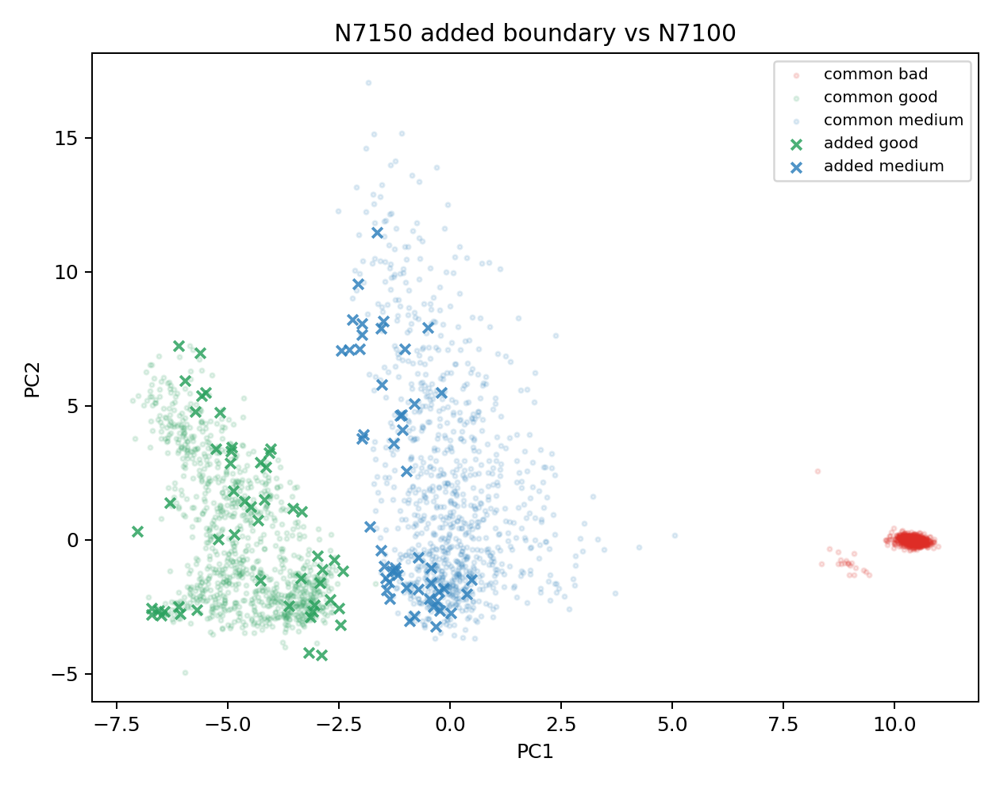

# N7150 Added Boundary Analysis

This analyzes rows selected by N7150_gm_trim_bad but not by N7100_gm_trim_bad. Original BUT is not used.

Selected N7100: 18284; selected N7150: 18384; added: 100; dropped: 0.

## Added Class Counts

| class_name | added n | rate |
|---|---:|---:|
| good | 50 | 0.500 |
| medium | 50 | 0.500 |

## Added Region Counts

| original_region | added n | rate |
|---|---:|---:|
| good_medium_overlap | 80 | 0.800 |
| clean_core | 10 | 0.100 |
| outlier_low_confidence | 10 | 0.100 |

## Added Ambiguous Type Counts

| ambiguous_type | added n | rate |
|---|---:|---:|
| good_medium_boundary | 80 | 0.800 |
| clean_or_target | 10 | 0.100 |
| isolated_good | 5 | 0.050 |
| good_medium_low_purity | 3 | 0.030 |
| isolated_medium | 2 | 0.020 |

## Good: Added vs Common Feature Gaps

| feature | added med | common med | robust delta |
|---|---:|---:|---:|
| pca_margin | 1.896 | 2.614 | -0.818 |
| pc3 | 0.5331 | -1.261 | 0.736 |
| boundary_confidence | 0.6563 | 0.7651 | -0.650 |
| pc4 | 2.549 | 0.2704 | 0.509 |
| qrs_visibility | 0.4001 | 0.578 | -0.507 |
| detector_agreement | 0.2444 | 0.3274 | -0.445 |
| non_qrs_rms_ratio | 0.2436 | 0.2964 | -0.285 |
| pc2 | 0.1027 | -1.029 | 0.266 |
| diff_abs_p95 | 0.1181 | 0.155 | -0.261 |
| non_qrs_diff_p95 | 0.04145 | 0.05041 | -0.258 |

## Medium: Added vs Common Feature Gaps

| feature | added med | common med | robust delta |
|---|---:|---:|---:|
| pca_margin | 1.362 | 2.449 | -0.986 |
| pc1 | -1.154 | -0.1666 | -0.859 |
| pc3 | 0.9392 | 2.33 | -0.742 |
| boundary_confidence | 0.5228 | 0.7285 | -0.731 |
| flatline_ratio | 0.1173 | 0.08527 | 0.714 |
| band_30_45 | 0.01929 | 0.02963 | -0.479 |
| qrs_visibility | 0.3715 | 0.2563 | 0.403 |
| non_qrs_diff_p95 | 0.08139 | 0.1053 | -0.373 |
| non_qrs_rms_ratio | 0.4107 | 0.4918 | -0.342 |
| pc2 | -0.817 | 0.6191 | -0.274 |

## Reading

- This is the next local boundary ring after the promoted N7100 model.
- If added rows stay good/medium-overlap dominated, use an added-ring generator rather than broad class-weight sweeps.
- Bad remains a guardrail; original BUT remains report-only and bucketed.