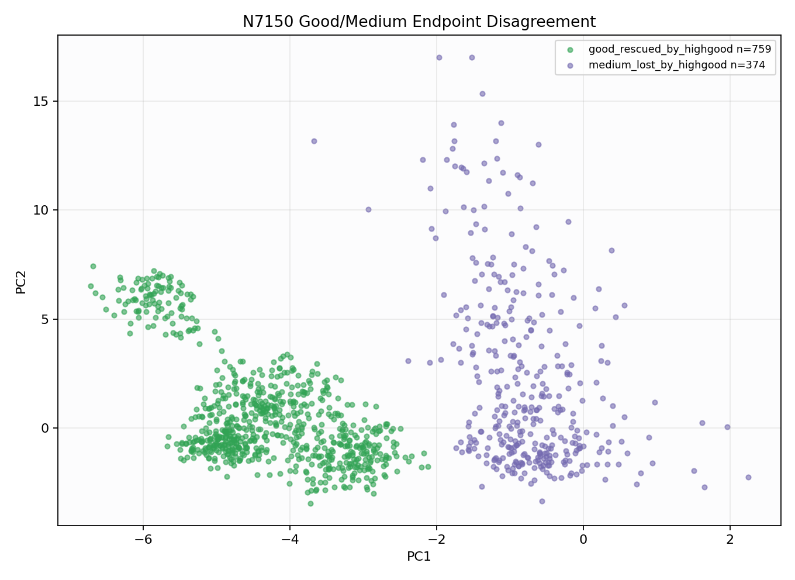

# N7150 Geometry Disagreement

High-good endpoint `nl_n7150_gm_trim_bad_geom_addedring_n7100base_g006_m020_g_e319672f8889`: acc 0.9414, good/medium/bad 0.9908/0.8752/0.9706.
Medium-strong endpoint `nl_n7150_gm_trim_bad_geom_addedring_n7100base_g004_m026_g_0662ffd18c65`: acc 0.9162, good/medium/bad 0.8846/0.9166/0.9706.

## Disagreement Counts
- `other`: 17251
- `good_rescued_by_highgood`: 759
- `medium_lost_by_highgood`: 374

## Medium-Strong Separator Features

## High-Good Separator Features
- `pc1` KS 0.989, good-rescued/medium-lost med -4.424/-0.8492
- `pc3` KS 0.880, good-rescued/medium-lost med -1.9/2.784
- `flatline_ratio` KS 0.865, good-rescued/medium-lost med 0.3122/0.1153
- `qrs_visibility` KS 0.757, good-rescued/medium-lost med 0.6124/0.2411
- `template_corr` KS 0.778, good-rescued/medium-lost med 0.7179/0.5369
- `knn_label_purity` KS 0.695, good-rescued/medium-lost med 1/0.8667
- `non_qrs_diff_p95` KS 0.636, good-rescued/medium-lost med 0.05095/0.0851
- `band_30_45` KS 0.531, good-rescued/medium-lost med 0.01384/0.02398

