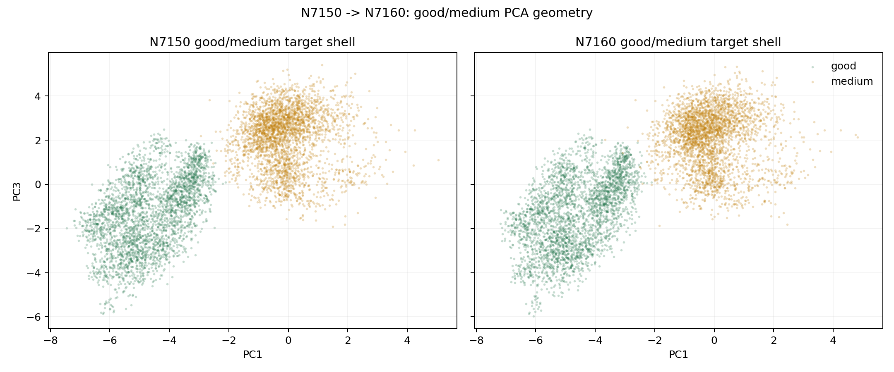
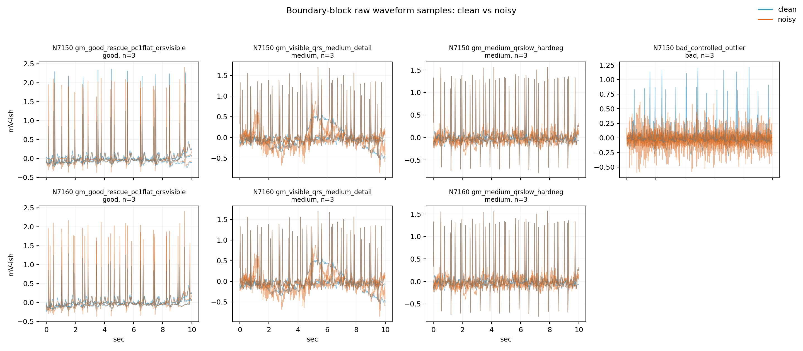

# N7150 to N7160 Boundary-Block Failure Analysis

## Executive read

N7150 is the current ordinary-checkpoint frontier: acc 0.954254, good/medium/bad 0.958881/0.940280/0.970617.
N7160 failed because the best pmed0005 mode became good-heavy: acc 0.937785, good/medium/bad 0.982821/0.874022/0.970617.
The trade was asymmetric: good->medium errors fell by 171, but medium->good errors rose by 475. Bad remained stable, so this is a local good/medium geometry failure, not a bad failure.

## Metrics

| node_id | node_level | variant_id | prediction_mode | n_total | acc | macro_f1 | good_recall | medium_recall | bad_recall | good_to_medium | medium_to_good | bad_to_good | bad_to_medium | gm_error_total | metric_note | confusion_3x3 |
| --- | --- | --- | --- | --- | --- | --- | --- | --- | --- | --- | --- | --- | --- | --- | --- | --- |
| N7150_gm_trim_bad | 7150 | nl_n7150_gm_trim_bad_boundaryblocks_micro_bad_probe_n7125_84064417a3c4 | raw | 18384 | 0.954254 | 0.958757 | 0.958881 | 0.94028 | 0.970617 | 294 | 427 | 0 | 120 | 721 | fallback_from_boundary_block_promotion_summary | [[6856, 294, 0], [427, 6723, 0], [0, 120, 3964]] |
| N7160_gm_trim_bad | 7160 | nl_n7160_gm_trim_bad_boundaryblocks_micro_good_pair_n7150_6bd59f8d5ac2 | medium_guarded_pmed0005 | 18404 | 0.937785 | 0.944465 | 0.982821 | 0.874022 | 0.970617 | 123 | 902 | 1 | 119 | 1025 | diagnostic_metrics_csv | [[7037, 123, 0], [902, 6258, 0], [1, 119, 3964]] |
| N7175_gm_trim_bad | 7175 | nl_n7175_gm_trim_bad_boundaryblocks_micro_bad_probe_n7150_969a76661658 | medium_guarded_pmed0005 |  | 0.912499 | 0.922614 | 0.973101 | 0.818676 | 0.970862 | 0 | 0 | 0 | 0 | 0 | fallback_from_run_summary |  |
| N7200_gm_trim_bad | 7200 | nl_n7200_gm_trim_bad_goodlike_aux_tail_a12_good124_mid172_ec4f54fe7e3d | medium_guarded_pmed0005 |  | 0.936431 | 0.943622 | 0.931389 | 0.922083 | 0.970617 | 0 | 0 | 0 | 0 | 0 | fallback_from_run_summary |  |

## Delta vs N7150

| node_id | variant_id | acc_delta_vs_n7150 | macro_f1_delta_vs_n7150 | good_recall_delta_vs_n7150 | medium_recall_delta_vs_n7150 | bad_recall_delta_vs_n7150 | good_to_medium_delta_vs_n7150 | medium_to_good_delta_vs_n7150 | gm_error_total_delta_vs_n7150 |
| --- | --- | --- | --- | --- | --- | --- | --- | --- | --- |
| N7150_gm_trim_bad | nl_n7150_gm_trim_bad_boundaryblocks_micro_bad_probe_n7125_84064417a3c4 | 0 | 0 | 0 | 0 | 0 | 0 | 0 | 0 |
| N7160_gm_trim_bad | nl_n7160_gm_trim_bad_boundaryblocks_micro_good_pair_n7150_6bd59f8d5ac2 | -0.0164684 | -0.0142918 | 0.0239401 | -0.0662574 | 1.5573e-11 | -171 | 475 | 304 |
| N7175_gm_trim_bad | nl_n7175_gm_trim_bad_boundaryblocks_micro_bad_probe_n7150_969a76661658 | -0.0417547 | -0.0361426 | 0.0142199 | -0.121604 | 0.000244958 | -294 | -427 | -721 |
| N7200_gm_trim_bad | nl_n7200_gm_trim_bad_goodlike_aux_tail_a12_good124_mid172_ec4f54fe7e3d | -0.0178222 | -0.0151346 | -0.0274921 | -0.0181967 | -4.21e-08 | -294 | -427 | -721 |

## Boundary Block Counts

| level | blend_source | y_class | n |
| --- | --- | --- | --- |
| 7150 | bad_controlled_outlier | bad | 6 |
| 7150 | gm_good_rescue_pc1flat_qrsvisible | good | 6 |
| 7150 | gm_medium_qrslow_hardneg | medium | 6 |
| 7150 | gm_visible_qrs_medium_detail | medium | 12 |
| 7160 | gm_good_rescue_pc1flat_qrsvisible | good | 12 |
| 7160 | gm_medium_qrslow_hardneg | medium | 6 |
| 7160 | gm_visible_qrs_medium_detail | medium | 12 |

## Top Good/Medium Feature Separation Changes

| feature | gm_median_sep_n7150 | gm_median_sep_n7160 | sep_delta_n7160_minus_n7150 | abs_sep_delta |
| --- | --- | --- | --- | --- |
| sqi_kSQI | -10.1419 | -10.1395 | 0.00234802 | 0.00234802 |
| pc1 | 4.6011 | 4.60002 | -0.00107896 | 0.00107896 |
| sqi_sSQI | -1.59639 | -1.59558 | 0.000808246 | 0.000808246 |
| pc3 | 3.5807 | 3.5802 | -0.000500946 | 0.000500946 |
| qrs_band_ratio | 0.00816238 | 0.00801227 | -0.000150112 | 0.000150112 |
| qrs_visibility | -0.321044 | -0.320923 | 0.000120957 | 0.000120957 |
| ptp_p99_p01 | -0.485108 | -0.485031 | 7.66627e-05 | 7.66627e-05 |
| template_corr | -0.11949 | -0.119534 | -4.33574e-05 | 4.33574e-05 |

## Boundary Block Feature Medians

| level | variant_id | block | y_class | n | qrs_nprd_median | qrs_nprd_p90 | tst_nprd_median | tst_nprd_p90 | beat_corr_median | beat_corr_p90 | damage_score_median | damage_score_p90 | core_diagnostic_score_median | core_diagnostic_score_p90 | proxy_rms_median | proxy_rms_p90 | proxy_basSQI_median | proxy_basSQI_p90 | proxy_kSQI_median | proxy_kSQI_p90 | proxy_sSQI_median | proxy_sSQI_p90 | rr_unacceptable_bins_median | rr_unacceptable_bins_p90 | rr_snr_mean_median | rr_snr_mean_p90 | rr_corr_mean_median | rr_corr_mean_p90 | fatal_subtype_strength_median | fatal_subtype_strength_p90 | sample_weight_median | sample_weight_p90 |
| --- | --- | --- | --- | --- | --- | --- | --- | --- | --- | --- | --- | --- | --- | --- | --- | --- | --- | --- | --- | --- | --- | --- | --- | --- | --- | --- | --- | --- | --- | --- | --- | --- |
| 7150 | nl_n7150_gm_trim_bad_boundaryblocks_micro_bad_probe_n7125_84064417a3c4 | bad_controlled_outlier | bad | 6 | 0.774511 | 1.00154 | 2.3588 | 3.39509 | 0.995192 | 0.998696 | 0.328282 | 0.527007 | 1.54271 | 3.50183 | 0.159482 | 0.175882 | 0.0657039 | 0.0999892 | 20.5151 | 25.1528 | 3.47367 | 3.91584 | 12 | 14 | -3.17379 | -2.2998 | 0.714481 | 0.735439 | 1.00394 | 1.07522 | 1.004 | 1.004 |
| 7150 | nl_n7150_gm_trim_bad_boundaryblocks_micro_bad_probe_n7125_84064417a3c4 | gm_good_rescue_pc1flat_qrsvisible | good | 6 | 0.0649549 | 0.0713253 | 0.325774 | 0.399235 | 0.999218 | 0.999776 | 0.0809902 | 0.0903097 | 0.230209 | 0.332247 | 0.15035 | 0.253457 | 0.0556594 | 0.073291 | 17.7657 | 26.6057 | 3.47135 | 4.3455 | 0 | 0 | 19.2768 | 19.7214 | 0.996896 | 0.998109 | 0 | 0 | 1.003 | 1.003 |
| 7150 | nl_n7150_gm_trim_bad_boundaryblocks_micro_bad_probe_n7125_84064417a3c4 | gm_medium_qrslow_hardneg | medium | 6 | 0.163346 | 0.19558 | 1.12052 | 1.31132 | 0.998982 | 0.999469 | 0.372751 | 0.391619 | 2.28129 | 2.46634 | 0.241343 | 0.370485 | 0.016684 | 0.0734016 | 20.2738 | 25.3948 | 3.85183 | 4.46425 | 0 | 1 | 11.0669 | 11.6548 | 0.96905 | 0.980267 | 0 | 0 | 1.005 | 1.005 |
| 7150 | nl_n7150_gm_trim_bad_boundaryblocks_micro_bad_probe_n7125_84064417a3c4 | gm_visible_qrs_medium_detail | medium | 12 | 0.241361 | 0.325739 | 1.01786 | 1.38024 | 0.998446 | 0.999198 | 0.320439 | 0.339735 | 1.90992 | 1.97457 | 0.209249 | 0.25139 | 0.0420686 | 0.104605 | 15.4372 | 34.739 | 3.02795 | 5.01614 | 3.5 | 6 | 6.36967 | 11.179 | 0.922141 | 0.974053 | 0 | 0 | 1.008 | 1.008 |
| 7160 | nl_n7160_gm_trim_bad_boundaryblocks_micro_good_pair_n7150_6bd59f8d5ac2 | gm_good_rescue_pc1flat_qrsvisible | good | 12 | 0.064803 | 0.069706 | 0.28154 | 0.398558 | 0.999218 | 0.99966 | 0.0750097 | 0.0894838 | 0.159387 | 0.285175 | 0.153326 | 0.300511 | 0.0509247 | 0.0739927 | 18.6727 | 26.7633 | 3.47135 | 4.53004 | 0 | 0 | 18.6196 | 19.4473 | 0.994997 | 0.997772 | 0 | 0 | 1.008 | 1.008 |
| 7160 | nl_n7160_gm_trim_bad_boundaryblocks_micro_good_pair_n7150_6bd59f8d5ac2 | gm_medium_qrslow_hardneg | medium | 6 | 0.163346 | 0.19558 | 1.12052 | 1.31132 | 0.998982 | 0.999469 | 0.372751 | 0.391619 | 2.28129 | 2.46634 | 0.241343 | 0.370485 | 0.016684 | 0.0734016 | 20.2738 | 25.3948 | 3.85183 | 4.46425 | 0 | 1 | 11.0669 | 11.6548 | 0.96905 | 0.980267 | 0 | 0 | 1.005 | 1.005 |
| 7160 | nl_n7160_gm_trim_bad_boundaryblocks_micro_good_pair_n7150_6bd59f8d5ac2 | gm_visible_qrs_medium_detail | medium | 12 | 0.241361 | 0.325739 | 1.01786 | 1.38024 | 0.998446 | 0.999198 | 0.320439 | 0.339735 | 1.90992 | 1.97457 | 0.209249 | 0.25139 | 0.0420686 | 0.104605 | 15.4372 | 34.739 | 3.02795 | 5.01614 | 3.5 | 6 | 6.36967 | 11.179 | 0.922141 | 0.974053 | 0 | 0 | 1.008 | 1.008 |

## Visuals

## Recommended next move

Do not widen directly from N7150 to N7160 with the current good-pair profile. The next experiment should be a smaller N7155-style step or a N7160 medium-guarded profile that reduces the good-rescue fraction/weight and adds only medium rows adjacent to the failing shell. Bad can stay as controlled-outlier guardrail; the current evidence does not justify broad bad expansion.