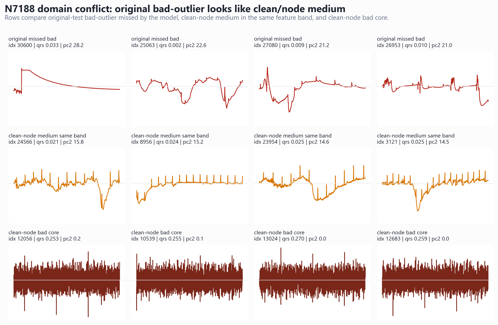

# N7188 Bad Domain Conflict Report

## Finding

The original-test missed bad-outlier band overlaps clean-node medium rather than clean-node bad. This supports keeping clean selection separate from original stress handling.

## Counts

- original-test bad-outlier missed: 279
- original-test bad-outlier caught: 13
- clean-node medium in original-missed feature band: 875
- clean-node bad in original-missed feature band: 0
- clean-node good in original-missed feature band: 0

## Waveforms

## Implication

A larger bad-outlier synthetic block can improve original stress recall only if we accept a clean-medium conflict. For clean/node selection, the safer next step is to keep the N7188 checkpoint and evaluate any bad-outlier handling as a transparent report-only stress rule.
