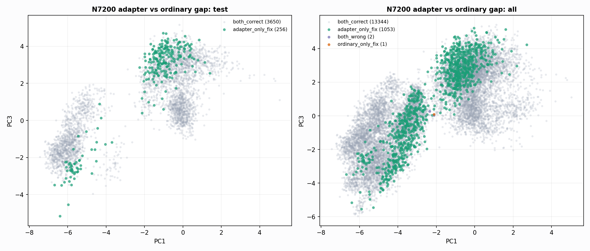

# N7200 Adapter-To-Training Gap

This compares the old-best N7200 checkpoint logits against the RF visual feature adapter on the same Clean/SemiClean/node diagnostic rows.

## Why This Matters

The adapter passes the node gate, but synthetic-row ordinary retraining has not. These rows identify what the ordinary network still fails to internalize.

## Adapter-Only Fix Counts

```
       gap_group class_name   n                          split_counts                                                                region_counts ordinary_pred_counts adapter_pred_counts
adapter_only_fix       good 492  {"train": 431, "test": 52, "val": 9}  {"good_medium_overlap": 445, "outlier_low_confidence": 44, "clean_core": 3}      {"medium": 492}       {"good": 492}
adapter_only_fix     medium 561 {"train": 354, "test": 204, "val": 3} {"good_medium_overlap": 452, "outlier_low_confidence": 76, "clean_core": 33}        {"good": 561}     {"medium": 561}
```

## Top Feature Gaps

```
           feature reference_group  adapter_only_median  reference_median  still_wrong_median  adapter_vs_reference_ks  adapter_vs_wrong_ks  adapter_only_iqr  reference_iqr
    old_best_p_bad    both_correct         1.632293e-07      1.390463e-08            0.000277                 0.342418                  NaN          0.000004   2.387075e-07
 old_best_p_medium    both_correct         3.198147e-04      3.188540e-04            0.747496                 0.333502                  NaN          0.503058   9.999492e-01
   old_best_p_good    both_correct         9.996795e-01      9.996809e-01            0.252227                 0.332602                  NaN          0.503113   9.999495e-01
old_best_gm_margin    both_correct         9.993596e-01      9.993621e-01           -0.495268                 0.332602                  NaN          1.006171   1.999899e+00
     low_amp_ratio    both_correct         2.224000e-01      2.456000e-01            0.244000                 0.234063                  NaN          0.107200   1.872000e-01
 amplitude_entropy    both_correct         6.764210e-01      6.590411e-01            0.658191                 0.232149                  NaN          0.073081   1.209209e-01
               pc1    both_correct        -1.616855e+00     -2.575403e+00           -2.227562                 0.214167                  NaN          2.911160   4.720252e+00
 non_qrs_rms_ratio    both_correct         4.021069e-01      3.718560e-01            0.391362                 0.195893                  NaN          0.146187   2.278752e-01
          sqi_sSQI    both_correct         3.652567e+00      3.767101e+00            3.620267                 0.192246                  NaN          0.915403   1.817964e+00
               pc4    both_correct        -5.886386e-01     -6.007863e-01           -0.839653                 0.171658                  NaN          1.152935   2.129386e+00
     template_corr    both_correct         5.917886e-01      6.300989e-01            0.664261                 0.167853                  NaN          0.141789   2.348735e-01
      qrs_prom_p90    both_correct         6.124329e+00      6.147206e+00            6.224092                 0.165423                  NaN          0.521583   1.262197e+00
```



