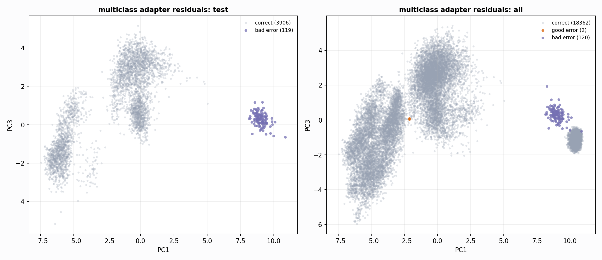

# N7200 Multiclass Feature Adapter

This adapter is trained only on Clean/SemiClean/node diagnostic rows and may output good, medium, or bad.

## Selected Adapter

- artifact: `adapter_n7200_multiclass_features_rf_multiclass_depth5_balanced`
- model: `rf_multiclass_depth5_balanced`
- selected on: `val`
- all-node acc: `0.993400`
- all-node macro-F1: `0.992183`
- all-node good/medium/bad recall: `0.999722` / `1.000000` / `0.970617`
- held-out test acc: `0.970435`
- held-out test good/medium/bad recall: `1.000000` / `1.000000` / `0.000000`

## All-Node Comparison

```
                                model      acc  macro_f1  good_recall  medium_recall  bad_recall  good_to_medium  medium_to_good  bad_to_medium
        rf_multiclass_depth7_balanced 0.993454  0.992229     0.999861       1.000000    0.970617               1               0            120
        rf_multiclass_depth5_balanced 0.993400  0.992183     0.999722       1.000000    0.970617               2               0            120
       logreg_multiclass_balanced_c03 0.993129  0.991952     0.999722       0.999306    0.970617               2               5            120
extratrees_multiclass_depth5_balanced 0.985230  0.985215     0.991528       0.987222    0.970617              61              92            120
```

## Held-Out Test Comparison

```
                                model      acc  macro_f1  good_recall  medium_recall  bad_recall  good_to_medium  medium_to_good  bad_to_medium
       logreg_multiclass_balanced_c03 0.970435  0.658927     1.000000       1.000000         0.0               0               0            119
        rf_multiclass_depth5_balanced 0.970435  0.658927     1.000000       1.000000         0.0               0               0            119
        rf_multiclass_depth7_balanced 0.970435  0.658927     1.000000       1.000000         0.0               0               0            119
extratrees_multiclass_depth5_balanced 0.961739  0.652480     0.996436       0.988014         0.0               5              30            119
```



## Caveat

This is a trained feature adapter, not a normal neural checkpoint. It is useful for diagnosing whether a lightweight post-hoc head can capture the remaining boundary.
