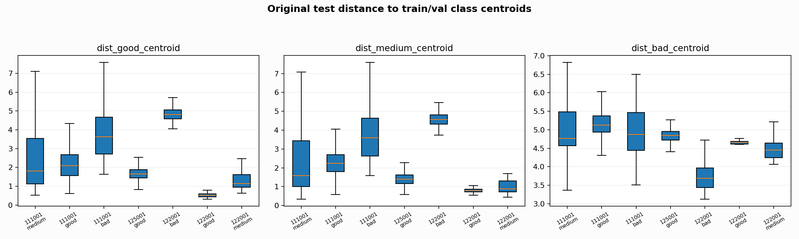

# Original Domain Shift Audit

Report-only audit. It asks whether original test rows live near the original train/val class geometry in the current feature space.

## Train/Val Centroid Classifier On Original Test

- Acc: `0.810546`
- Recall good/medium/bad: `0.750549/0.905332/0.321168`
- Confusion: `[[2732, 905, 3], [358, 4007, 61], [65, 214, 132]]`

If this simple centroid probe is poor, the original test split is not aligned with train/val geometry even before any PTB/SemiClean transfer issue.

## Original Test Rows By Nearest Train/Val Centroid

| record_id | class_name | nearest_centroid_class | n | support | rate |
| --- | --- | --- | --- | --- | --- |
| 111001 | bad | medium | 213 | 292 | 0.729452 |
| 111001 | bad | good | 65 | 292 | 0.222603 |
| 111001 | bad | bad | 14 | 292 | 0.047945 |
| 111001 | good | good | 2657 | 3336 | 0.796463 |
| 111001 | good | medium | 676 | 3336 | 0.202638 |
| 111001 | good | bad | 3 | 3336 | 0.000899 |
| 111001 | medium | medium | 3971 | 4390 | 0.904556 |
| 111001 | medium | good | 358 | 4390 | 0.081549 |
| 111001 | medium | bad | 61 | 4390 | 0.013895 |
| 122001 | bad | bad | 118 | 119 | 0.991597 |
| 122001 | bad | medium | 1 | 119 | 0.008403 |
| 122001 | good | good | 75 | 76 | 0.986842 |
| 122001 | good | medium | 1 | 76 | 0.013158 |
| 122001 | medium | medium | 36 | 36 | 1.000000 |
| 125001 | good | medium | 228 | 228 | 1.000000 |

## Distance Medians

| record_id | class_name | dist_good_centroid | dist_medium_centroid | dist_bad_centroid | centroid_margin_second_minus_best |
| --- | --- | --- | --- | --- | --- |
| 111001 | bad | 3.636523 | 3.595717 | 4.875809 | 0.043531 |
| 111001 | good | 2.088043 | 2.241975 | 5.128449 | 0.148319 |
| 111001 | medium | 1.819262 | 1.593692 | 4.767054 | 0.142287 |
| 122001 | bad | 4.820126 | 4.562684 | 3.692819 | 0.900456 |
| 122001 | good | 0.517565 | 0.797295 | 4.654459 | 0.302444 |
| 122001 | medium | 1.137904 | 0.885261 | 4.454381 | 0.212723 |
| 125001 | good | 1.659810 | 1.401385 | 4.846485 | 0.247894 |

## Split / Record / Class Counts

| split | record_id | bad | good | medium |
| --- | --- | --- | --- | --- |
| test | 111001 | 292 | 3336 | 4390 |
| test | 122001 | 119 | 76 | 36 |
| test | 125001 | 0 | 228 | 0 |
| train | 100001 | 22 | 5786 | 2556 |
| train | 100002 | 0 | 114 | 49 |
| train | 104001 | 0 | 136 | 67 |
| train | 105001 | 4734 | 5501 | 3049 |
| train | 113001 | 4 | 199 | 75 |
| train | 115001 | 0 | 134 | 45 |
| train | 118001 | 0 | 131 | 61 |
| train | 121001 | 0 | 167 | 13 |
| train | 123001 | 0 | 196 | 9 |
| train | 124001 | 31 | 70 | 173 |
| val | 103001 | 0 | 141 | 34 |
| val | 103002 | 0 | 199 | 7 |
| val | 103003 | 0 | 176 | 13 |
| val | 114001 | 83 | 229 | 51 |
| val | 126001 | 0 | 224 | 0 |

## Interpretation
- This audit is not a classifier proposal; it is a geometry sanity check.
- Large centroid disagreement means the original test split contains record/domain-specific label geometry that simple PTB/CleanBUT fitting cannot fully infer.
- Stable next steps should target the record/domain blocks as broad synthetic styles or report-only stress buckets, not tiny rules.
