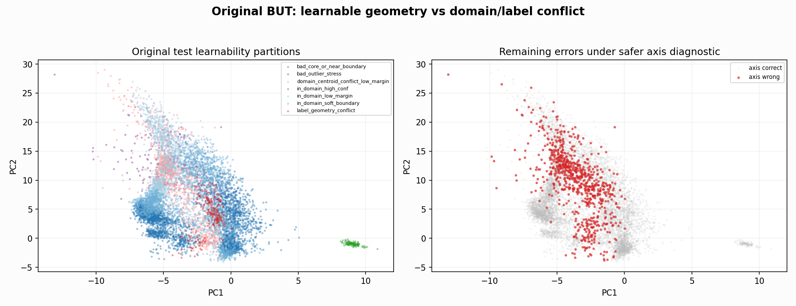
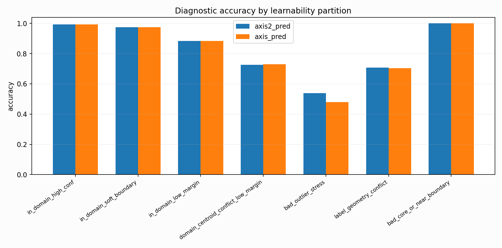

# Original Learnability Partition

Report-only diagnostic. This does not select or promote a model. It partitions original test rows by whether their label agrees with the original train+val feature geometry.

## Overall Diagnostic Metrics

- Safer axis diagnostic: acc `0.908104`, macro-F1 `0.839910`, good/medium/bad recall `0.908242/0.933800/0.630170`.
- More aggressive axis2 diagnostic: acc `0.910228`, macro-F1 `0.847387`, good/medium/bad recall `0.908242/0.934026/0.671533`.

## Partition Metrics

| pred_col | learnability_partition | n | acc | macro_f1 | good_recall | medium_recall | bad_recall | support_good | support_medium | support_bad |
| --- | --- | --- | --- | --- | --- | --- | --- | --- | --- | --- |
| axis_pred | in_domain_high_conf | 3176 | 0.992758 | 0.661818 | 0.997290 | 0.988824 | 0.000000 | 1476 | 1700 | 0 |
| axis_pred | in_domain_soft_boundary | 1959 | 0.973966 | 0.650003 | 0.963016 | 0.980096 | 0.000000 | 703 | 1256 | 0 |
| axis_pred | in_domain_low_margin | 1604 | 0.883416 | 0.596934 | 0.949367 | 0.848716 | 0.000000 | 553 | 1051 | 0 |
| axis_pred | domain_centroid_conflict_low_margin | 1091 | 0.728689 | 0.487000 | 0.674581 | 0.832000 | 0.000000 | 716 | 375 | 0 |
| axis_pred | bad_outlier_stress | 292 | 0.479452 | 0.216049 | 0.000000 | 0.000000 | 0.479452 | 0 | 0 | 292 |
| axis_pred | label_geometry_conflict | 236 | 0.703390 | 0.378902 | 0.776042 | 0.386364 | 0.000000 | 192 | 44 | 0 |
| axis_pred | bad_core_or_near_boundary | 119 | 1.000000 | 0.333333 | 0.000000 | 0.000000 | 1.000000 | 0 | 0 | 119 |
| axis2_pred | in_domain_high_conf | 3176 | 0.993388 | 0.662239 | 0.997290 | 0.990000 | 0.000000 | 1476 | 1700 | 0 |
| axis2_pred | in_domain_soft_boundary | 1959 | 0.974477 | 0.650619 | 0.965861 | 0.979299 | 0.000000 | 703 | 1256 | 0 |
| axis2_pred | in_domain_low_margin | 1604 | 0.884040 | 0.599148 | 0.951175 | 0.848716 | 0.000000 | 553 | 1051 | 0 |
| axis2_pred | domain_centroid_conflict_low_margin | 1091 | 0.725023 | 0.485209 | 0.670391 | 0.829333 | 0.000000 | 716 | 375 | 0 |
| axis2_pred | bad_outlier_stress | 292 | 0.537671 | 0.233111 | 0.000000 | 0.000000 | 0.537671 | 0 | 0 | 292 |
| axis2_pred | label_geometry_conflict | 236 | 0.707627 | 0.384949 | 0.776042 | 0.409091 | 0.000000 | 192 | 44 | 0 |
| axis2_pred | bad_core_or_near_boundary | 119 | 1.000000 | 0.333333 | 0.000000 | 0.000000 | 1.000000 | 0 | 0 | 119 |

## Largest Partition / Record / Class Blocks

| learnability_partition | record_id | class_name | n |
| --- | --- | --- | --- |
| bad_core_or_near_boundary | 122001 | bad | 119 |
| bad_outlier_stress | 111001 | bad | 292 |
| domain_centroid_conflict_low_margin | 111001 | good | 673 |
| domain_centroid_conflict_low_margin | 111001 | medium | 375 |
| domain_centroid_conflict_low_margin | 125001 | good | 42 |
| domain_centroid_conflict_low_margin | 122001 | good | 1 |
| in_domain_high_conf | 111001 | medium | 1676 |
| in_domain_high_conf | 111001 | good | 1415 |
| in_domain_high_conf | 122001 | good | 61 |
| in_domain_high_conf | 122001 | medium | 24 |
| in_domain_low_margin | 111001 | medium | 1048 |
| in_domain_low_margin | 111001 | good | 551 |
| in_domain_low_margin | 122001 | medium | 3 |
| in_domain_low_margin | 122001 | good | 2 |
| in_domain_soft_boundary | 111001 | medium | 1247 |
| in_domain_soft_boundary | 111001 | good | 691 |
| in_domain_soft_boundary | 122001 | good | 12 |
| in_domain_soft_boundary | 122001 | medium | 9 |
| label_geometry_conflict | 125001 | good | 186 |
| label_geometry_conflict | 111001 | medium | 44 |
| label_geometry_conflict | 111001 | good | 6 |

## Diagnostic Subset Metrics

These are for interpretation only. Full original test remains the external report bucket; the subsets explain which slices are already learnable versus conflict/stress.

| pred_col | diagnostic_subset | n | coverage | acc | macro_f1 | good_recall | medium_recall | bad_recall | support_good | support_medium | support_bad |
| --- | --- | --- | --- | --- | --- | --- | --- | --- | --- | --- | --- |
| axis_pred | full_original_test | 8477 | 1.000000 | 0.908104 | 0.839910 | 0.908242 | 0.933800 | 0.630170 | 3640 | 4426 | 411 |
| axis_pred | in_domain_all_plus_badcore | 6858 | 0.809013 | 0.961942 | 0.907191 | 0.978770 | 0.949339 | 1.000000 | 2732 | 4007 | 119 |
| axis_pred | high_soft_plus_badcore | 5254 | 0.619795 | 0.985915 | 0.977467 | 0.986232 | 0.985115 | 1.000000 | 2179 | 2956 | 119 |
| axis_pred | high_conf_plus_badcore | 3295 | 0.388699 | 0.993020 | 0.995151 | 0.997290 | 0.988824 | 1.000000 | 1476 | 1700 | 119 |
| axis_pred | conflict_only | 1327 | 0.156541 | 0.724190 | 0.477267 | 0.696035 | 0.785203 | 0.000000 | 908 | 419 | 0 |
| axis_pred | bad_stress_only | 292 | 0.034446 | 0.479452 | 0.216049 | 0.000000 | 0.000000 | 0.479452 | 0 | 0 | 292 |
| axis2_pred | full_original_test | 8477 | 1.000000 | 0.910228 | 0.847387 | 0.908242 | 0.934026 | 0.671533 | 3640 | 4426 | 411 |
| axis2_pred | in_domain_all_plus_badcore | 6858 | 0.809013 | 0.962526 | 0.901243 | 0.979868 | 0.949588 | 1.000000 | 2732 | 4007 | 119 |
| axis2_pred | high_soft_plus_badcore | 5254 | 0.619795 | 0.986486 | 0.976657 | 0.987150 | 0.985453 | 1.000000 | 2179 | 2956 | 119 |
| axis2_pred | high_conf_plus_badcore | 3295 | 0.388699 | 0.993627 | 0.995572 | 0.997290 | 0.990000 | 1.000000 | 1476 | 1700 | 119 |
| axis2_pred | conflict_only | 1327 | 0.156541 | 0.721929 | 0.476368 | 0.692731 | 0.785203 | 0.000000 | 908 | 419 | 0 |
| axis2_pred | bad_stress_only | 292 | 0.034446 | 0.537671 | 0.233111 | 0.000000 | 0.000000 | 0.537671 | 0 | 0 | 292 |

## Strongest Feature Gaps

| comparison | feature | a_median | b_median | delta | abs_delta_over_iqr |
| --- | --- | --- | --- | --- | --- |
| axis_error | qrs_band_ratio | 0.209393 | 0.394182 | -0.184789 | 0.758331 |
| axis_error | band_15_30 | 0.058566 | 0.166517 | -0.107951 | 0.690660 |
| axis_error | pc2 | 10.393936 | 4.964963 | 5.428972 | 0.624149 |
| axis_error | qrs_prom_p90 | 3.869299 | 6.178931 | -2.309632 | 0.570208 |
| axis_error | sqi_sSQI | 0.791923 | 2.843670 | -2.051746 | 0.547966 |
| axis_error | amplitude_entropy | 0.811144 | 0.715415 | 0.095729 | 0.539063 |
| axis_error | ptp_p99_p01 | 0.870353 | 1.240897 | -0.370544 | 0.537317 |
| axis_error | sqi_basSQI | 0.637163 | 0.786901 | -0.149738 | 0.514290 |
| axis_error | band_30_45 | 0.006800 | 0.021673 | -0.014873 | 0.502919 |
| axis_error | non_qrs_rms_ratio | 0.611328 | 0.429374 | 0.181954 | 0.474775 |
| axis_error | sqi_kSQI | 5.623982 | 16.639338 | -11.015355 | 0.435456 |
| axis_error | std | 0.176841 | 0.209339 | -0.032497 | 0.433919 |
| axis_error | rms | 0.179870 | 0.212497 | -0.032626 | 0.417766 |
| axis_error | baseline_step | 1.198744 | 0.883909 | 0.314835 | 0.405193 |
| axis_error | low_amp_ratio | 0.136000 | 0.179200 | -0.043200 | 0.360000 |
| axis_error | detector_agreement | 0.232567 | 0.258569 | -0.026002 | 0.267821 |
| axis_error | template_corr | 0.490149 | 0.532788 | -0.042639 | 0.233396 |
| axis_error | qrs_visibility | 0.066889 | 0.116413 | -0.049524 | 0.217564 |
| axis_error | mean_abs | 0.131136 | 0.127451 | 0.003685 | 0.187331 |
| axis_error | fatal_or_score | 0.975000 | 1.000000 | -0.025000 | 0.156438 |
| axis_error | sqi_bSQI | 0.818182 | 0.833333 | -0.015152 | 0.109091 |
| axis_error | diff_abs_p95 | 0.056834 | 0.067143 | -0.010309 | 0.093088 |
| axis_error | pc4 | 0.865925 | 0.567516 | 0.298409 | 0.072586 |
| axis_error | pc3 | -0.201363 | 0.061929 | -0.263292 | 0.070002 |
| axis_error | non_qrs_diff_p95 | 0.026793 | 0.030673 | -0.003879 | 0.056969 |
| axis_error | flatline_ratio | 0.265813 | 0.256605 | 0.009207 | 0.030831 |
| axis_error | pc1 | -3.547530 | -3.437293 | -0.110237 | 0.024039 |
| axis_error | contact_loss_win_ratio | 0.000000 | 0.000000 | 0.000000 | 0.000000 |
| bad_outlier_stress_vs_bad_core | detector_agreement | 0.286169 | 0.550510 | -0.264341 | 1.417945 |
| bad_outlier_stress_vs_bad_core | band_30_45 | 0.006896 | 0.276748 | -0.269852 | 1.116083 |
| bad_outlier_stress_vs_bad_core | band_15_30 | 0.031042 | 0.321031 | -0.289989 | 1.052633 |
| bad_outlier_stress_vs_bad_core | non_qrs_diff_p95 | 0.039336 | 0.417235 | -0.377899 | 1.040692 |
| bad_outlier_stress_vs_bad_core | diff_abs_p95 | 0.072075 | 0.437352 | -0.365277 | 0.997398 |
| bad_outlier_stress_vs_bad_core | pc1 | -4.251713 | 9.005379 | -13.257093 | 0.978387 |
| bad_outlier_stress_vs_bad_core | baseline_step | 1.378621 | 0.247530 | 1.131091 | 0.932412 |

## Interpretation

- `in_domain_high_conf` is the slice that already agrees with original train+val geometry; if this slice is poor, the classifier needs broad feature repair.
- `label_geometry_conflict` means the row label is far from its own original train+val class centroid and closer to another class. This is the dangerous slice for synthetic fitting: adding PTB samples to force this label may damage the clean diagnostic.
- `bad_outlier_stress` is report-only stress. It should be learned gradually only if it does not collide with clean-node medium/good.
- The next generator should target large learnable blocks first and treat high-margin label-geometry conflicts as either separate domain adaptation or explicit diagnostic buckets, not as ordinary clean promotion targets.
