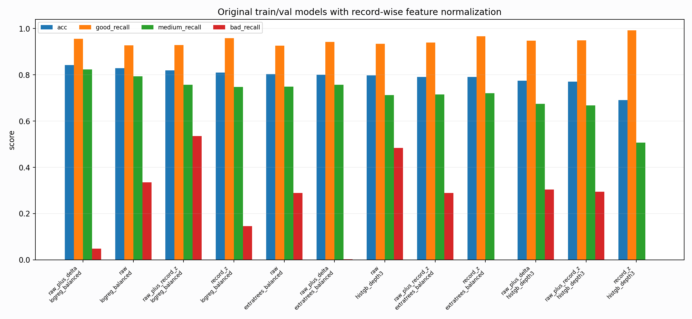

# Original Record-Normalized Probe

Report-only diagnostic. This tests whether simple unsupervised record-wise feature normalization reduces BUT original split/domain shift.

## Metrics

| feature_mode | model | split | n | acc | macro_f1 | good_recall | medium_recall | bad_recall |
| --- | --- | --- | --- | --- | --- | --- | --- | --- |
| raw_plus_delta | logreg_balanced | test | 8477 | 0.842633 | 0.605569 | 0.955769 | 0.823317 | 0.048662 |
| raw | logreg_balanced | test | 8477 | 0.828595 | 0.723091 | 0.927198 | 0.793267 | 0.335766 |
| raw_plus_record_z | logreg_balanced | test | 8477 | 0.819512 | 0.695625 | 0.928297 | 0.756439 | 0.535280 |
| record_z | logreg_balanced | test | 8477 | 0.809131 | 0.629746 | 0.958516 | 0.747854 | 0.145985 |
| raw | extratrees_balanced | test | 8477 | 0.802407 | 0.692261 | 0.925824 | 0.748531 | 0.289538 |
| raw_plus_delta | extratrees_balanced | test | 8477 | 0.799811 | 0.548008 | 0.942582 | 0.756439 | 0.002433 |
| raw | histgb_depth3 | test | 8477 | 0.796862 | 0.689432 | 0.934615 | 0.712607 | 0.484185 |
| raw_plus_record_z | extratrees_balanced | test | 8477 | 0.791200 | 0.684526 | 0.939835 | 0.715545 | 0.289538 |
| record_z | extratrees_balanced | test | 8477 | 0.790610 | 0.540212 | 0.965934 | 0.719837 | 0.000000 |
| raw_plus_delta | histgb_depth3 | test | 8477 | 0.773977 | 0.670658 | 0.948077 | 0.674424 | 0.304136 |
| raw_plus_record_z | histgb_depth3 | test | 8477 | 0.769848 | 0.666600 | 0.948352 | 0.667194 | 0.294404 |
| record_z | histgb_depth3 | test | 8477 | 0.690928 | 0.467027 | 0.992308 | 0.507230 | 0.000000 |
| raw | histgb_depth3 | val_train_only | 1157 | 0.941227 | 0.881789 | 0.954592 | 0.838095 | 0.915663 |
| raw_plus_delta | logreg_balanced | val_train_only | 1157 | 0.903198 | 0.813673 | 0.926729 | 0.619048 | 0.987952 |
| raw_plus_record_z | histgb_depth3 | val_train_only | 1157 | 0.899741 | 0.832757 | 0.908153 | 0.790476 | 0.939759 |
| raw | logreg_balanced | val_train_only | 1157 | 0.887640 | 0.844851 | 0.871001 | 0.952381 | 1.000000 |
| raw_plus_delta | histgb_depth3 | val_train_only | 1157 | 0.885048 | 0.821205 | 0.887513 | 0.819048 | 0.939759 |
| record_z | histgb_depth3 | val_train_only | 1157 | 0.853068 | 0.781719 | 0.843137 | 0.990476 | 0.795181 |
| raw_plus_record_z | extratrees_balanced | val_train_only | 1157 | 0.838375 | 0.783053 | 0.825593 | 0.914286 | 0.891566 |
| raw | extratrees_balanced | val_train_only | 1157 | 0.826275 | 0.775622 | 0.812178 | 0.885714 | 0.915663 |
| raw_plus_delta | extratrees_balanced | val_train_only | 1157 | 0.823682 | 0.779872 | 0.802890 | 0.933333 | 0.927711 |
| raw_plus_record_z | logreg_balanced | val_train_only | 1157 | 0.804667 | 0.752127 | 0.794634 | 0.771429 | 0.963855 |
| record_z | logreg_balanced | val_train_only | 1157 | 0.714780 | 0.537018 | 0.733746 | 0.895238 | 0.265060 |
| record_z | extratrees_balanced | val_train_only | 1157 | 0.691443 | 0.401902 | 0.717234 | 1.000000 | 0.000000 |

## Best Test Model

- Feature mode: `raw_plus_delta`
- Model: `logreg_balanced`
- Acc: `0.842633`
- Macro-F1: `0.605569`
- Good/medium/bad recall: `0.955769/0.823317/0.048662`

## Interpretation

Record-wise normalization is a broad, simple domain-adaptation hypothesis. If it helps, the next PTB generator should vary record-level style and calibration rather than adding many local label rules. If it hurts, the original gap is more label-geometry-specific than simple record scale/offset.
