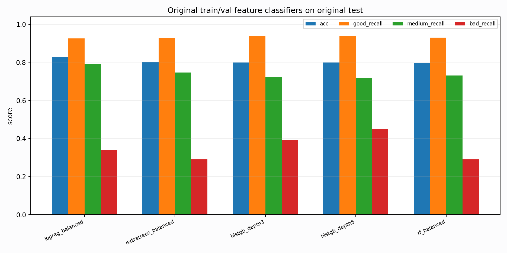

# Original Train/Val Model Probe

Report-only diagnostic. These models train on original train/val feature rows and evaluate on original test. They are not used for node promotion.

## Metrics

| model | split | n | acc | macro_f1 | good_recall | medium_recall | bad_recall | support_good | support_medium | support_bad |
| --- | --- | --- | --- | --- | --- | --- | --- | --- | --- | --- |
| logreg_balanced | test | 8477 | 0.827297 | 0.723032 | 0.926374 | 0.791234 | 0.338200 | 3640 | 4426 | 411 |
| extratrees_balanced | test | 8477 | 0.801817 | 0.691853 | 0.927198 | 0.746272 | 0.289538 | 3640 | 4426 | 411 |
| histgb_depth3 | test | 8477 | 0.799693 | 0.712022 | 0.939011 | 0.723000 | 0.391727 | 3640 | 4426 | 411 |
| histgb_depth5 | test | 8477 | 0.798750 | 0.707907 | 0.936813 | 0.717578 | 0.450122 | 3640 | 4426 | 411 |
| rf_balanced | test | 8477 | 0.794857 | 0.687060 | 0.929670 | 0.730908 | 0.289538 | 3640 | 4426 | 411 |
| histgb_depth3 | val_train_only | 1157 | 0.932584 | 0.878324 | 0.940144 | 0.838095 | 0.963855 | 969 | 105 | 83 |
| histgb_depth5 | val_train_only | 1157 | 0.916162 | 0.857678 | 0.920537 | 0.847619 | 0.951807 | 969 | 105 | 83 |
| logreg_balanced | val_train_only | 1157 | 0.878997 | 0.836150 | 0.861713 | 0.942857 | 1.000000 | 969 | 105 | 83 |
| rf_balanced | val_train_only | 1157 | 0.870354 | 0.816325 | 0.862745 | 0.866667 | 0.963855 | 969 | 105 | 83 |
| extratrees_balanced | val_train_only | 1157 | 0.830596 | 0.777902 | 0.818369 | 0.876190 | 0.915663 | 969 | 105 | 83 |

## Best Test Model

- Model: `logreg_balanced`
- Acc: `0.827297`
- Macro-F1: `0.723032`
- Good/medium/bad recall: `0.926374/0.791234/0.338200`

## Top Feature Importances

| model | feature | importance |
| --- | --- | --- |
| extratrees_balanced | pc1 | 0.075553 |
| extratrees_balanced | sample_entropy_proxy | 0.064578 |
| extratrees_balanced | zero_crossing_rate | 0.051858 |
| extratrees_balanced | higuchi_fd_proxy | 0.046828 |
| extratrees_balanced | band_15_30 | 0.044429 |
| extratrees_balanced | flatline_ratio | 0.043756 |
| extratrees_balanced | diff_abs_median | 0.041459 |
| extratrees_balanced | sqi_bSQI | 0.039286 |
| extratrees_balanced | sqi_pSQI | 0.038471 |
| extratrees_balanced | non_qrs_diff_p95 | 0.036585 |
| extratrees_balanced | hjorth_mobility | 0.032139 |
| extratrees_balanced | band_5_15 | 0.030429 |
| logreg_balanced | sample_entropy_proxy | 1.714480 |
| logreg_balanced | pc3 | 1.387777 |
| logreg_balanced | rms | 1.170178 |
| logreg_balanced | medium_detail_unreliable_score | 1.102192 |
| logreg_balanced | qrs_visibility | 1.045598 |
| logreg_balanced | pc1 | 0.995020 |
| logreg_balanced | qrs_prom_median | 0.957147 |
| logreg_balanced | sqi_sSQI | 0.942739 |
| logreg_balanced | amplitude_entropy | 0.921731 |
| logreg_balanced | hjorth_activity | 0.902282 |
| logreg_balanced | higuchi_fd_proxy | 0.856977 |
| logreg_balanced | pc2 | 0.856904 |
| rf_balanced | pc1 | 0.108665 |
| rf_balanced | sample_entropy_proxy | 0.102673 |
| rf_balanced | higuchi_fd_proxy | 0.098369 |
| rf_balanced | flatline_ratio | 0.066380 |
| rf_balanced | wavelet_e4 | 0.065025 |
| rf_balanced | hjorth_complexity | 0.054941 |
| rf_balanced | hjorth_mobility | 0.054009 |
| rf_balanced | diff_abs_median | 0.053648 |
| rf_balanced | non_qrs_diff_p95 | 0.051212 |
| rf_balanced | zero_crossing_rate | 0.044875 |
| rf_balanced | band_15_30 | 0.022797 |
| rf_balanced | sqi_bSQI | 0.020731 |

## Interpretation

If original train/val feature-only models do not approach the clean-node diagnostic, the remaining original gap is not only PTB generator coverage. It means the original test split has record/domain or label-boundary geometry that is hard to infer even from BUT train/val itself.
