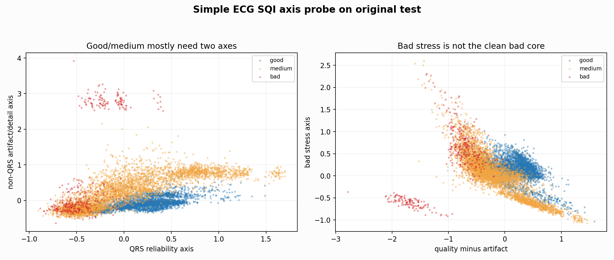

# Simple ECG Axis Probe

Report-only diagnostic. The axes are intentionally broad and interpretable: QRS reliability, non-QRS artifact/detail, baseline/contact, and spike irregularity.

## Top Axis Separators

| comparison | axis | auc_abs_oriented | best_direction | best_threshold | best_balanced_acc | n |
| --- | --- | --- | --- | --- | --- | --- |
| bad_vs_nonbad | simple_quality_minus_artifact | 0.947102 | <= | -0.432347 | 0.871404 | 8477 |
| bad_vs_nonbad | qrs_reliability_axis | 0.824605 | <= | 0.004870 | 0.762142 | 8477 |
| bad_vs_nonbad | bad_stress_axis | 0.642047 | >= | 0.394712 | 0.690565 | 8477 |
| bad_vs_nonbad | baseline_contact_axis | 0.586007 | >= | 0.427908 | 0.629405 | 8477 |
| bad_vs_nonbad | non_qrs_artifact_axis | 0.554553 | >= | 0.882091 | 0.625862 | 8477 |
| bad_vs_nonbad | spike_irregularity_axis | 0.637876 | <= | -0.279498 | 0.614775 | 8477 |
| good_errors_vs_medium_errors | spike_irregularity_axis | 0.655340 | <= | -0.310741 | 0.619248 | 626 |
| good_errors_vs_medium_errors | bad_stress_axis | 0.661092 | <= | 0.238661 | 0.610348 | 626 |
| good_errors_vs_medium_errors | simple_quality_minus_artifact | 0.605395 | >= | -0.378769 | 0.601950 | 626 |
| good_errors_vs_medium_errors | qrs_reliability_axis | 0.586826 | >= | -0.199202 | 0.581956 | 626 |
| good_errors_vs_medium_errors | baseline_contact_axis | 0.581361 | <= | 0.370403 | 0.581474 | 626 |
| good_errors_vs_medium_errors | non_qrs_artifact_axis | 0.508039 | <= | 0.173126 | 0.526157 | 626 |
| good_vs_medium | simple_quality_minus_artifact | 0.759882 | >= | -0.095661 | 0.728297 | 8066 |
| good_vs_medium | non_qrs_artifact_axis | 0.668359 | <= | 0.195342 | 0.720064 | 8066 |
| good_vs_medium | spike_irregularity_axis | 0.692163 | >= | 0.303751 | 0.685678 | 8066 |
| good_vs_medium | qrs_reliability_axis | 0.669814 | >= | -0.035044 | 0.676188 | 8066 |
| good_vs_medium | bad_stress_axis | 0.592085 | >= | 0.007544 | 0.631236 | 8066 |
| good_vs_medium | baseline_contact_axis | 0.582045 | >= | -0.328711 | 0.604616 | 8066 |

## Interpretation

If one axis had solved the boundary, this table would show near-perfect balanced accuracy. Instead, good/medium and bad-stress need at least two broad axes: QRS reliability plus artifact/detail or baseline/contact. This supports a simple two-axis research story rather than many tiny rules.
