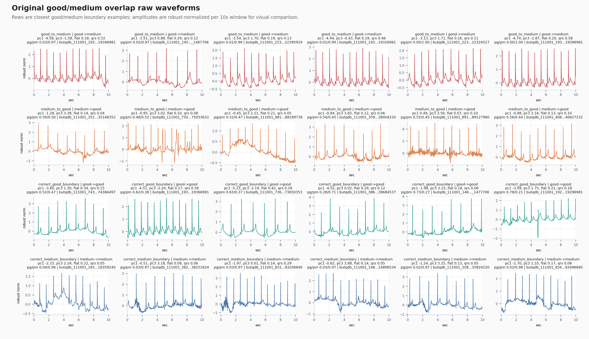
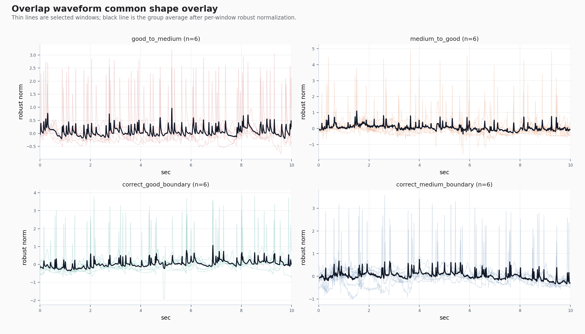
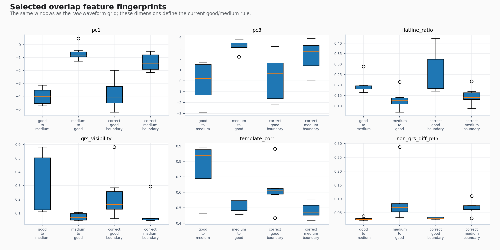
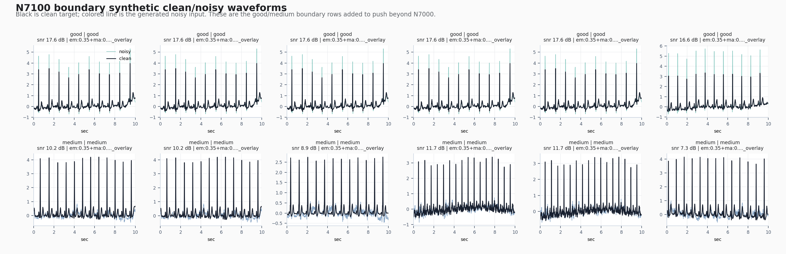

# Good/Medium Overlap Waveform Panels

## What Was Plotted
- Original panels use p1_current_10s_center BUT windows and report-only N7200 filtered-original predictions. The bad filter does not change good/medium rows used here.
- Synthetic panels use the promoted N7100 geometry variant and show clean/noisy pairs from its added good/medium boundary ring.
- Amplitudes are robust-normalized per window for shape comparison; this is visualization only.

## 10s Label Scope
- Original test 10s+ windows: 8477.
- Explicit 10s label-scope failures in protocol: 0.
- Raw short consensus annotation segments dropped before protocol generation: 4468.

## Common Geometry Signal
- Good rescued from medium is still the pc1-low / pc3-low / flatline-high / QRS-visible shape family.
- Medium that gets eaten by good tends to move away from that band: pc1 is less negative, pc3 is higher, flatline is lower, and non-QRS detail is higher.
- The repair direction should stay paired: add lightly contaminated good only together with visible-QRS medium hard negatives.

## Key Images

## Selected Feature Medians

- `correct_good_boundary` n=6, pc1=-4.056, pc3=0.6604, flatline_ratio=0.2482, qrs_visibility=0.1628, template_corr=0.6105, non_qrs_diff_p95=0.0302
- `correct_medium_boundary` n=6, pc1=-1.469, pc3=2.711, flatline_ratio=0.1405, qrs_visibility=0.05685, template_corr=0.4715, non_qrs_diff_p95=0.07543
- `good_to_medium` n=6, pc1=-3.99, pc3=0.2275, flatline_ratio=0.191, qrs_visibility=0.2978, template_corr=0.8376, non_qrs_diff_p95=0.02592
- `medium_to_good` n=6, pc1=-0.8605, pc3=3.272, flatline_ratio=0.1249, qrs_visibility=0.06894, template_corr=0.5052, non_qrs_diff_p95=0.0687

## Error-Direction Feature Gap
- `pc1`: good->medium median -3.99, medium->good median -0.8605, delta -3.129
- `pc3`: good->medium median 0.2275, medium->good median 3.272, delta -3.045
- `flatline_ratio`: good->medium median 0.191, medium->good median 0.1249, delta 0.06605
- `qrs_visibility`: good->medium median 0.2978, medium->good median 0.06894, delta 0.2288
- `template_corr`: good->medium median 0.8376, medium->good median 0.5052, delta 0.3324
- `non_qrs_diff_p95`: good->medium median 0.02592, medium->good median 0.0687, delta -0.04278
- `qrs_band_ratio`: good->medium median 0.3856, medium->good median 0.4076, delta -0.02203
- `baseline_step`: good->medium median 0.556, medium->good median 0.7255, delta -0.1695
- `rms`: good->medium median 0.2178, medium->good median 0.2082, delta 0.009602
- `mean_abs`: good->medium median 0.1313, medium->good median 0.1308, delta 0.000473
