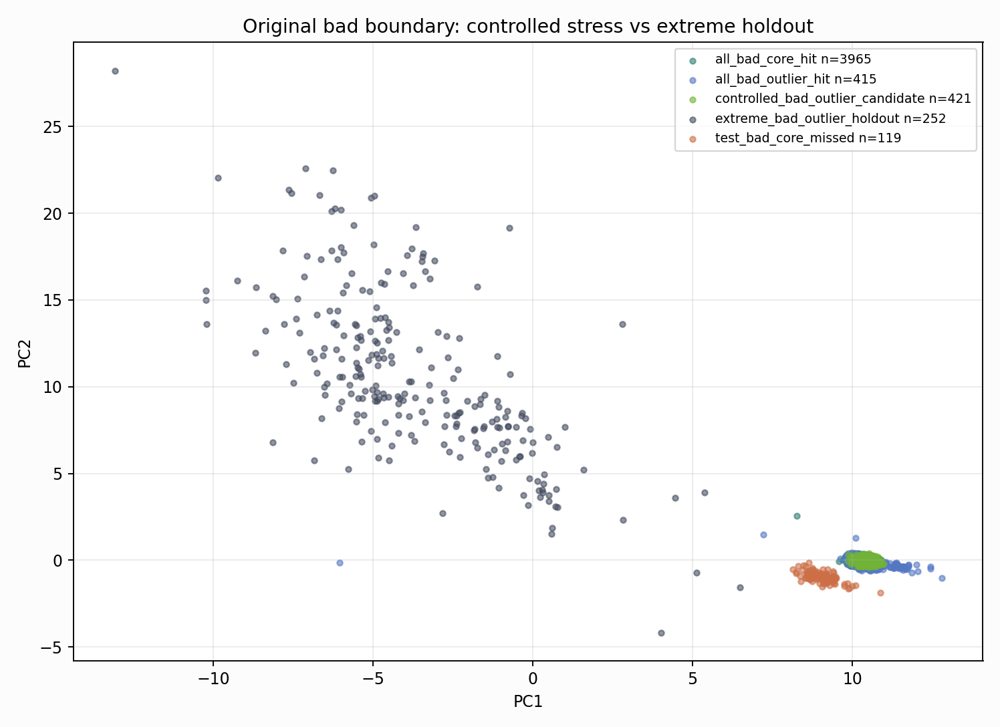
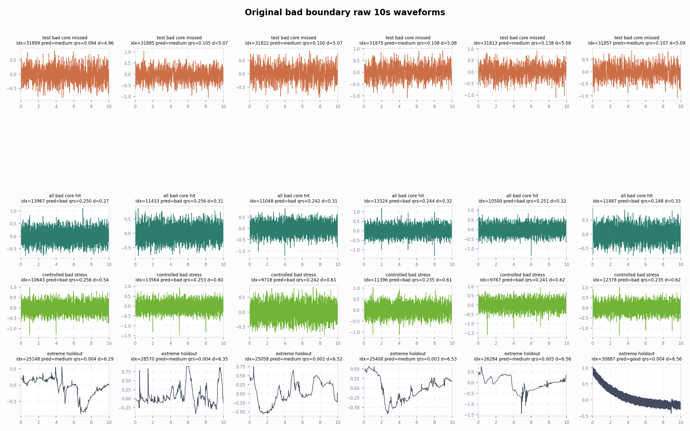

# Original Bad Boundary Repair Analysis

Original is report-only here. The goal is to identify a controlled bad-stress shape for future synthetic design, not to select a checkpoint on original.

## Counts

- `all_bad_core_hit`: 3965
- `controlled_bad_outlier_candidate`: 421
- `all_bad_outlier_hit`: 415
- `extreme_bad_outlier_holdout`: 252
- `test_bad_core_missed`: 119
- `missed_mid_bad_outlier_candidate`: 113

- Controlled bad outlier candidates: `421`
- Controlled distance threshold q35: `0.9614`
- Extreme holdout distance threshold q80: `6.7058`

## Main Feature Gaps

### Test bad core missed vs all bad core hit
- `band_30_45` KS 1.000, median missed/hit 0.2767/0.1036
- `pc4` KS 1.000, median missed/hit -1.557/0.6296
- `band_15_30` KS 1.000, median missed/hit 0.321/0.8344
- `baseline_step` KS 1.000, median missed/hit 0.2475/0.02705
- `boundary_confidence` KS 1.000, median missed/hit 0.3907/0.7572
- `pca_margin` KS 1.000, median missed/hit 5.349/10.95

### Controlled outlier vs extreme holdout
- `band_15_30` KS 1.000, median controlled/extreme 0.8335/0.04149
- `baseline_step` KS 1.000, median controlled/extreme 0.02672/1.26
- `boundary_confidence` KS 1.000, median controlled/extreme 0.4976/0.02299
- `knn_label_purity` KS 1.000, median controlled/extreme 1/0
- `pc1` KS 1.000, median controlled/extreme 10.43/-4.338
- `pca_margin` KS 1.000, median controlled/extreme 10.5/-6.661

## Figures

