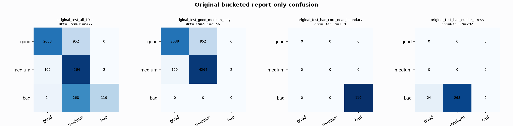

# Original Bucketed Checkpoint Report

Report-only evaluation. It is not used for Clean/SemiClean/node selection.

## Checkpoint

- Variant: `nl_n10000_gm_trim_bad_boundaryblocks_n10000shell_goodprot_0d3423971d38`
- Prediction mode: `simple_pc1_lowqrs_medium_keep_qbr030_flat012`

## Buckets

- `original_all_10s+`: n=32956, acc=0.8459, macro-F1=0.8696, recall good/medium/bad=0.7520/0.9542/0.9311
- `original_test_all_10s+`: n=8477, acc=0.8341, macro-F1=0.7112, recall good/medium/bad=0.7385/0.9634/0.2895
- `original_test_good_medium_only`: n=8066, acc=0.8619, macro-F1=0.5710, recall good/medium/bad=0.7385/0.9634/0.0000
- `original_test_bad_core_near_boundary`: n=119, acc=1.0000, macro-F1=0.3333, recall good/medium/bad=0.0000/0.0000/1.0000
- `original_test_bad_outlier_stress`: n=292, acc=0.0000, macro-F1=0.0000, recall good/medium/bad=0.0000/0.0000/0.0000
- `original_test_drop_bad_outlier_reference`: n=8185, acc=0.8639, macro-F1=0.9016, recall good/medium/bad=0.7385/0.9634/1.0000
- `original_test_good_medium_overlap`: n=7492, acc=0.8513, macro-F1=0.5655, recall good/medium/bad=0.7357/0.9584/0.0000
- `original_all_bad_core_near_boundary`: n=4084, acc=0.9998, macro-F1=0.3333, recall good/medium/bad=0.0000/0.0000/0.9998
- `original_all_bad_outlier_stress`: n=1201, acc=0.6978, macro-F1=0.2740, recall good/medium/bad=0.0000/0.0000/0.6978

## Counts

- Original all 10s+: `32956` windows.
- Original test 10s+: `8477` windows.
- Bad outlier stress is reported separately because dropping it removes most original-test bad windows.

