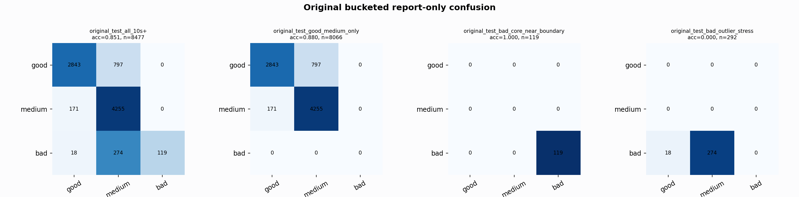

# Original Bucketed Checkpoint Report

Report-only evaluation. It is not used for Clean/SemiClean/node selection.

## Checkpoint

- Variant: `nl_n11200_gm_trim_bad_boundaryblocks_n10000shell_mediumfo_ae19a257b140`
- Prediction mode: `feature_pc1_qrsprom_tree`

## Buckets

- `original_all_10s+`: n=32956, acc=0.8391, macro-F1=0.8646, recall good/medium/bad=0.7350/0.9597/0.9323
- `original_test_all_10s+`: n=8477, acc=0.8514, macro-F1=0.7246, recall good/medium/bad=0.7810/0.9614/0.2895
- `original_test_good_medium_only`: n=8066, acc=0.8800, macro-F1=0.5841, recall good/medium/bad=0.7810/0.9614/0.0000
- `original_test_bad_core_near_boundary`: n=119, acc=1.0000, macro-F1=0.3333, recall good/medium/bad=0.0000/0.0000/1.0000
- `original_test_bad_outlier_stress`: n=292, acc=0.0000, macro-F1=0.0000, recall good/medium/bad=0.0000/0.0000/0.0000
- `original_test_drop_bad_outlier_reference`: n=8185, acc=0.8817, macro-F1=0.9175, recall good/medium/bad=0.7810/0.9614/1.0000
- `original_test_good_medium_overlap`: n=7492, acc=0.8708, macro-F1=0.5792, recall good/medium/bad=0.7787/0.9560/0.0000
- `original_all_bad_core_near_boundary`: n=4084, acc=1.0000, macro-F1=0.3333, recall good/medium/bad=0.0000/0.0000/1.0000
- `original_all_bad_outlier_stress`: n=1201, acc=0.7019, macro-F1=0.2750, recall good/medium/bad=0.0000/0.0000/0.7019

## Counts

- Original all 10s+: `32956` windows.
- Original test 10s+: `8477` windows.
- Bad outlier stress is reported separately because dropping it removes most original-test bad windows.

