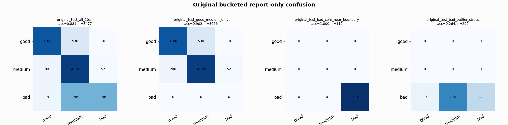

# Original Bucketed Checkpoint Report

Report-only evaluation. It is not used for Clean/SemiClean/node selection.

## Checkpoint

- Variant: `nl_n11200_gm_trim_bad_boundaryblocks_n10000shell_thinprob_84079be0011f`
- Prediction mode: `feature_pc1_qrsprom_visiblegood_plus_precision_veto`

## Buckets

- `original_all_10s+`: n=32956, acc=0.8307, macro-F1=0.8562, recall good/medium/bad=0.7509/0.9008/0.9470
- `original_test_all_10s+`: n=8477, acc=0.8812, macro-F1=0.7907, recall good/medium/bad=0.8516/0.9431/0.4769
- `original_test_good_medium_only`: n=8066, acc=0.9018, macro-F1=0.6026, recall good/medium/bad=0.8516/0.9431/0.0000
- `original_test_bad_core_near_boundary`: n=119, acc=1.0000, macro-F1=0.3333, recall good/medium/bad=0.0000/0.0000/1.0000
- `original_test_bad_outlier_stress`: n=292, acc=0.2637, macro-F1=0.1391, recall good/medium/bad=0.0000/0.0000/0.2637
- `original_test_drop_bad_outlier_reference`: n=8185, acc=0.9032, macro-F1=0.8670, recall good/medium/bad=0.8516/0.9431/1.0000
- `original_test_good_medium_overlap`: n=7492, acc=0.8944, macro-F1=0.5985, recall good/medium/bad=0.8501/0.9355/0.0000
- `original_all_bad_core_near_boundary`: n=4084, acc=1.0000, macro-F1=0.3333, recall good/medium/bad=0.0000/0.0000/1.0000
- `original_all_bad_outlier_stress`: n=1201, acc=0.7669, macro-F1=0.2893, recall good/medium/bad=0.0000/0.0000/0.7669

## Counts

- Original all 10s+: `32956` windows.
- Original test 10s+: `8477` windows.
- Bad outlier stress is reported separately because dropping it removes most original-test bad windows.

