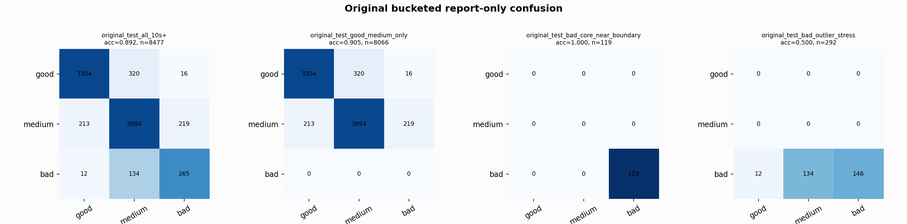

# Original Bucketed Checkpoint Report

Report-only evaluation. It is not used for Clean/SemiClean/node selection.

## Checkpoint

- Variant: `nl_n11200_gm_trim_bad_boundaryblocks_n10000shell_thinprob_84079be0011f`
- Prediction mode: `rawbad_feature_pc1_qrsprom_visiblegood_wavegood_axis_diagnostic`

## Buckets

- `original_all_10s+`: n=32956, acc=0.8234, macro-F1=0.8479, recall good/medium/bad=0.7255/0.9114/0.9625
- `original_test_all_10s+`: n=8477, acc=0.8922, macro-F1=0.8012, recall good/medium/bad=0.9077/0.9024/0.6448
- `original_test_good_medium_only`: n=8066, acc=0.9048, macro-F1=0.6124, recall good/medium/bad=0.9077/0.9024/0.0000
- `original_test_bad_core_near_boundary`: n=119, acc=1.0000, macro-F1=0.3333, recall good/medium/bad=0.0000/0.0000/1.0000
- `original_test_bad_outlier_stress`: n=292, acc=0.5000, macro-F1=0.2222, recall good/medium/bad=0.0000/0.0000/0.5000
- `original_test_drop_bad_outlier_reference`: n=8185, acc=0.9062, macro-F1=0.7801, recall good/medium/bad=0.9077/0.9024/1.0000
- `original_test_good_medium_overlap`: n=7492, acc=0.8975, macro-F1=0.6081, recall good/medium/bad=0.9067/0.8889/0.0000
- `original_all_bad_core_near_boundary`: n=4084, acc=1.0000, macro-F1=0.3333, recall good/medium/bad=0.0000/0.0000/1.0000
- `original_all_bad_outlier_stress`: n=1201, acc=0.8351, macro-F1=0.3034, recall good/medium/bad=0.0000/0.0000/0.8351

## Counts

- Original all 10s+: `32956` windows.
- Original test 10s+: `8477` windows.
- Bad outlier stress is reported separately because dropping it removes most original-test bad windows.

