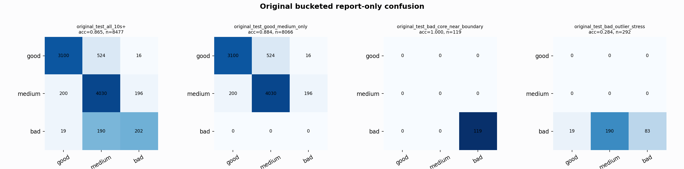

# Original Bucketed Checkpoint Report

Report-only evaluation. It is not used for Clean/SemiClean/node selection.

## Checkpoint

- Variant: `nl_n11200_gm_trim_bad_boundaryblocks_n10000shell_thinprob_84079be0011f`
- Prediction mode: `rawbad_feature_pc1_qrsprom_visiblegood_plus_precision_veto`

## Buckets

- `original_all_10s+`: n=32956, acc=0.8260, macro-F1=0.8485, recall good/medium/bad=0.7509/0.8856/0.9483
- `original_test_all_10s+`: n=8477, acc=0.8649, macro-F1=0.7532, recall good/medium/bad=0.8516/0.9105/0.4915
- `original_test_good_medium_only`: n=8066, acc=0.8840, macro-F1=0.5970, recall good/medium/bad=0.8516/0.9105/0.0000
- `original_test_bad_core_near_boundary`: n=119, acc=1.0000, macro-F1=0.3333, recall good/medium/bad=0.0000/0.0000/1.0000
- `original_test_bad_outlier_stress`: n=292, acc=0.2842, macro-F1=0.1476, recall good/medium/bad=0.0000/0.0000/0.2842
- `original_test_drop_bad_outlier_reference`: n=8185, acc=0.8856, macro-F1=0.7733, recall good/medium/bad=0.8516/0.9105/1.0000
- `original_test_good_medium_overlap`: n=7492, acc=0.8752, macro-F1=0.5920, recall good/medium/bad=0.8501/0.8985/0.0000
- `original_all_bad_core_near_boundary`: n=4084, acc=1.0000, macro-F1=0.3333, recall good/medium/bad=0.0000/0.0000/1.0000
- `original_all_bad_outlier_stress`: n=1201, acc=0.7727, macro-F1=0.2906, recall good/medium/bad=0.0000/0.0000/0.7727

## Counts

- Original all 10s+: `32956` windows.
- Original test 10s+: `8477` windows.
- Bad outlier stress is reported separately because dropping it removes most original-test bad windows.

