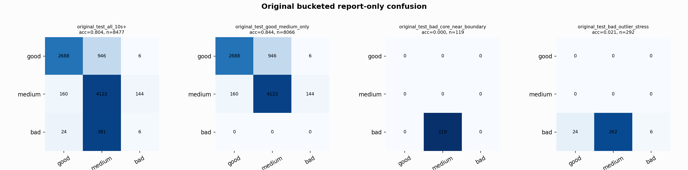

# Original Bucketed Checkpoint Report

Report-only evaluation. It is not used for Clean/SemiClean/node selection.

## Checkpoint

- Variant: `nl_n11200_gm_trim_bad_boundaryblocks_n10000shell_thinprob_84079be0011f`
- Prediction mode: `simple_pc1_lowqrs_medium_keep_qbr030_flat012`

## Buckets

- `original_all_10s+`: n=32956, acc=0.8377, macro-F1=0.8567, recall good/medium/bad=0.7520/0.9392/0.9101
- `original_test_all_10s+`: n=8477, acc=0.8041, macro-F1=0.5605, recall good/medium/bad=0.7385/0.9313/0.0146
- `original_test_good_medium_only`: n=8066, acc=0.8443, macro-F1=0.5656, recall good/medium/bad=0.7385/0.9313/0.0000
- `original_test_bad_core_near_boundary`: n=119, acc=0.0000, macro-F1=0.0000, recall good/medium/bad=0.0000/0.0000/0.0000
- `original_test_bad_outlier_stress`: n=292, acc=0.0205, macro-F1=0.0134, recall good/medium/bad=0.0000/0.0000/0.0205
- `original_test_drop_bad_outlier_reference`: n=8185, acc=0.8320, macro-F1=0.5621, recall good/medium/bad=0.7385/0.9313/0.0000
- `original_test_good_medium_overlap`: n=7492, acc=0.8324, macro-F1=0.5594, recall good/medium/bad=0.7357/0.9219/0.0000
- `original_all_bad_core_near_boundary`: n=4084, acc=0.9706, macro-F1=0.3284, recall good/medium/bad=0.0000/0.0000/0.9706
- `original_all_bad_outlier_stress`: n=1201, acc=0.7044, macro-F1=0.2755, recall good/medium/bad=0.0000/0.0000/0.7044

## Counts

- Original all 10s+: `32956` windows.
- Original test 10s+: `8477` windows.
- Bad outlier stress is reported separately because dropping it removes most original-test bad windows.

