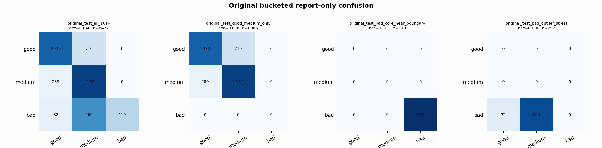

# Original Bucketed Checkpoint Report

Report-only evaluation. It is not used for Clean/SemiClean/node selection.

## Checkpoint

- Variant: `nl_n12000_gm_trim_bad_boundaryblocks_n10000shell_thinprob_e10ae874c49d`
- Prediction mode: `feature_pc1_qrsprom_tree_n12000_trainval`

## Buckets

- `original_all_10s+`: n=32956, acc=0.8565, macro-F1=0.8772, recall good/medium/bad=0.7879/0.9293/0.9313
- `original_test_all_10s+`: n=8477, acc=0.8477, macro-F1=0.7225, recall good/medium/bad=0.8049/0.9347/0.2895
- `original_test_good_medium_only`: n=8066, acc=0.8761, macro-F1=0.5822, recall good/medium/bad=0.8049/0.9347/0.0000
- `original_test_bad_core_near_boundary`: n=119, acc=1.0000, macro-F1=0.3333, recall good/medium/bad=0.0000/0.0000/1.0000
- `original_test_bad_outlier_stress`: n=292, acc=0.0000, macro-F1=0.0000, recall good/medium/bad=0.0000/0.0000/0.0000
- `original_test_drop_bad_outlier_reference`: n=8185, acc=0.8779, macro-F1=0.9155, recall good/medium/bad=0.8049/0.9347/1.0000
- `original_test_good_medium_overlap`: n=7492, acc=0.8667, macro-F1=0.5770, recall good/medium/bad=0.8029/0.9257/0.0000
- `original_all_bad_core_near_boundary`: n=4084, acc=1.0000, macro-F1=0.3333, recall good/medium/bad=0.0000/0.0000/1.0000
- `original_all_bad_outlier_stress`: n=1201, acc=0.6978, macro-F1=0.2740, recall good/medium/bad=0.0000/0.0000/0.6978

## Counts

- Original all 10s+: `32956` windows.
- Original test 10s+: `8477` windows.
- Bad outlier stress is reported separately because dropping it removes most original-test bad windows.

