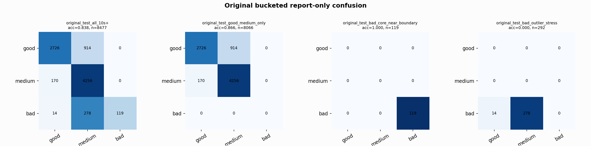

# Original Bucketed Checkpoint Report

Report-only evaluation. It is not used for Clean/SemiClean/node selection.

## Checkpoint

- Variant: `nl_n12800_gm_trim_bad_boundaryblocks_large_badcore_goodpr_f02566aabecc`
- Prediction mode: `feature_pc1_qrsprom_tree_mediumveto_n12800_trainval`

## Buckets

- `original_all_10s+`: n=32956, acc=0.8639, macro-F1=0.8827, recall good/medium/bad=0.8041/0.9262/0.9313
- `original_test_all_10s+`: n=8477, acc=0.8377, macro-F1=0.7145, recall good/medium/bad=0.7489/0.9616/0.2895
- `original_test_good_medium_only`: n=8066, acc=0.8656, macro-F1=0.5737, recall good/medium/bad=0.7489/0.9616/0.0000
- `original_test_bad_core_near_boundary`: n=119, acc=1.0000, macro-F1=0.3333, recall good/medium/bad=0.0000/0.0000/1.0000
- `original_test_bad_outlier_stress`: n=292, acc=0.0000, macro-F1=0.0000, recall good/medium/bad=0.0000/0.0000/0.0000
- `original_test_drop_bad_outlier_reference`: n=8185, acc=0.8676, macro-F1=0.9071, recall good/medium/bad=0.7489/0.9616/1.0000
- `original_test_good_medium_overlap`: n=7492, acc=0.8553, macro-F1=0.5683, recall good/medium/bad=0.7463/0.9563/0.0000
- `original_all_bad_core_near_boundary`: n=4084, acc=1.0000, macro-F1=0.3333, recall good/medium/bad=0.0000/0.0000/1.0000
- `original_all_bad_outlier_stress`: n=1201, acc=0.6978, macro-F1=0.2740, recall good/medium/bad=0.0000/0.0000/0.6978

## Counts

- Original all 10s+: `32956` windows.
- Original test 10s+: `8477` windows.
- Bad outlier stress is reported separately because dropping it removes most original-test bad windows.

