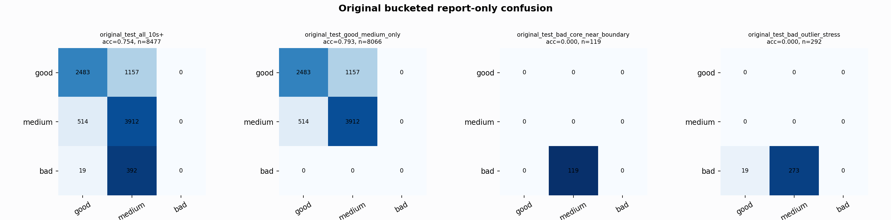

# Original Bucketed Checkpoint Report

Report-only evaluation. It is not used for Clean/SemiClean/node selection.

## Checkpoint

- Variant: `nl_n7125_gm_trim_bad_boundaryblocks_micro_bad_probe_n7125_83c93e7640e0`
- Prediction mode: `medium_guarded_pmed0005`

## Buckets

- `original_all_10s+`: n=32956, acc=0.8478, macro-F1=0.8650, recall good/medium/bad=0.8358/0.8369/0.9086
- `original_test_all_10s+`: n=8477, acc=0.7544, macro-F1=0.5125, recall good/medium/bad=0.6821/0.8839/0.0000
- `original_test_good_medium_only`: n=8066, acc=0.7928, macro-F1=0.5241, recall good/medium/bad=0.6821/0.8839/0.0000
- `original_test_bad_core_near_boundary`: n=119, acc=0.0000, macro-F1=0.0000, recall good/medium/bad=0.0000/0.0000/0.0000
- `original_test_bad_outlier_stress`: n=292, acc=0.0000, macro-F1=0.0000, recall good/medium/bad=0.0000/0.0000/0.0000
- `original_test_drop_bad_outlier_reference`: n=8185, acc=0.7813, macro-F1=0.5207, recall good/medium/bad=0.6821/0.8839/0.0000
- `original_test_good_medium_overlap`: n=7492, acc=0.7772, macro-F1=0.5158, recall good/medium/bad=0.6788/0.8684/0.0000
- `original_all_bad_core_near_boundary`: n=4084, acc=0.9706, macro-F1=0.3284, recall good/medium/bad=0.0000/0.0000/0.9706
- `original_all_bad_outlier_stress`: n=1201, acc=0.6978, macro-F1=0.2740, recall good/medium/bad=0.0000/0.0000/0.6978

## Counts

- Original all 10s+: `32956` windows.
- Original test 10s+: `8477` windows.
- Bad outlier stress is reported separately because dropping it removes most original-test bad windows.

