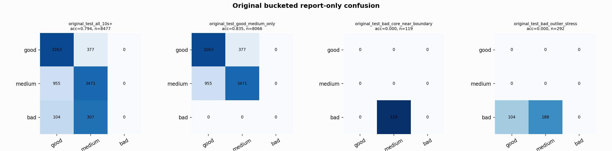

# Original Bucketed Checkpoint Report

Report-only evaluation. It is not used for Clean/SemiClean/node selection.

## Checkpoint

- Variant: `nl_n7150_gm_trim_bad_boundaryblocks_micro_bad_probe_n7125_84064417a3c4`
- Prediction mode: `raw`

## Buckets

- `original_all_10s+`: n=32956, acc=0.8402, macro-F1=0.8594, recall good/medium/bad=0.8226/0.8341/0.9088
- `original_test_all_10s+`: n=8477, acc=0.7944, macro-F1=0.5429, recall good/medium/bad=0.8964/0.7842/0.0000
- `original_test_good_medium_only`: n=8066, acc=0.8349, macro-F1=0.5565, recall good/medium/bad=0.8964/0.7842/0.0000
- `original_test_bad_core_near_boundary`: n=119, acc=0.0000, macro-F1=0.0000, recall good/medium/bad=0.0000/0.0000/0.0000
- `original_test_bad_outlier_stress`: n=292, acc=0.0000, macro-F1=0.0000, recall good/medium/bad=0.0000/0.0000/0.0000
- `original_test_drop_bad_outlier_reference`: n=8185, acc=0.8227, macro-F1=0.5525, recall good/medium/bad=0.8964/0.7842/0.0000
- `original_test_good_medium_overlap`: n=7492, acc=0.8233, macro-F1=0.5487, recall good/medium/bad=0.8953/0.7566/0.0000
- `original_all_bad_core_near_boundary`: n=4084, acc=0.9706, macro-F1=0.3284, recall good/medium/bad=0.0000/0.0000/0.9706
- `original_all_bad_outlier_stress`: n=1201, acc=0.6986, macro-F1=0.2742, recall good/medium/bad=0.0000/0.0000/0.6986

## Counts

- Original all 10s+: `32956` windows.
- Original test 10s+: `8477` windows.
- Bad outlier stress is reported separately because dropping it removes most original-test bad windows.

