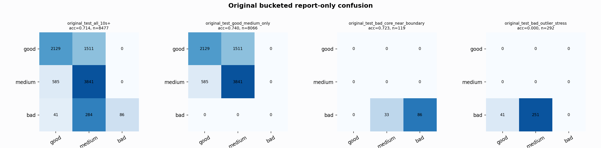

# Original Bucketed Checkpoint Report

Report-only evaluation. It is not used for Clean/SemiClean/node selection.

## Checkpoint

- Variant: `nl_n7179_gm_trim_bad_boundaryblocks_ultramicro_goodmed_n7_7a210e9eef05`
- Prediction mode: `medium_guarded_pmed001`

## Buckets

- `original_all_10s+`: n=32956, acc=0.8045, macro-F1=0.8329, recall good/medium/bad=0.7727/0.7954/0.9256
- `original_test_all_10s+`: n=8477, acc=0.7144, macro-F1=0.5918, recall good/medium/bad=0.5849/0.8678/0.2092
- `original_test_good_medium_only`: n=8066, acc=0.7401, macro-F1=0.4853, recall good/medium/bad=0.5849/0.8678/0.0000
- `original_test_bad_core_near_boundary`: n=119, acc=0.7227, macro-F1=0.2797, recall good/medium/bad=0.0000/0.0000/0.7227
- `original_test_bad_outlier_stress`: n=292, acc=0.0000, macro-F1=0.0000, recall good/medium/bad=0.0000/0.0000/0.0000
- `original_test_drop_bad_outlier_reference`: n=8185, acc=0.7399, macro-F1=0.7641, recall good/medium/bad=0.5849/0.8678/0.7227
- `original_test_good_medium_overlap`: n=7492, acc=0.7210, macro-F1=0.4756, recall good/medium/bad=0.5805/0.8512/0.0000
- `original_all_bad_core_near_boundary`: n=4084, acc=0.9919, macro-F1=0.3320, recall good/medium/bad=0.0000/0.0000/0.9919
- `original_all_bad_outlier_stress`: n=1201, acc=0.7002, macro-F1=0.2746, recall good/medium/bad=0.0000/0.0000/0.7002

## Counts

- Original all 10s+: `32956` windows.
- Original test 10s+: `8477` windows.
- Bad outlier stress is reported separately because dropping it removes most original-test bad windows.

