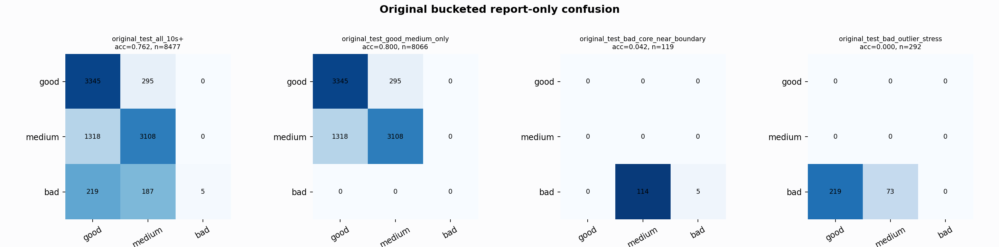

# Original Bucketed Checkpoint Report

Report-only evaluation. It is not used for Clean/SemiClean/node selection.

## Checkpoint

- Variant: `nl_n7180_gm_trim_bad_boundaryblocks_origbridge_badstressp_f9488c4af248`
- Prediction mode: `simple_pc1_gm_gate_t254`

## Buckets

- `original_all_10s+`: n=32956, acc=0.8184, macro-F1=0.8437, recall good/medium/bad=0.7747/0.8430/0.9097
- `original_test_all_10s+`: n=8477, acc=0.7618, macro-F1=0.5282, recall good/medium/bad=0.9190/0.7022/0.0122
- `original_test_good_medium_only`: n=8066, acc=0.8000, macro-F1=0.5332, recall good/medium/bad=0.9190/0.7022/0.0000
- `original_test_bad_core_near_boundary`: n=119, acc=0.0420, macro-F1=0.0269, recall good/medium/bad=0.0000/0.0000/0.0420
- `original_test_bad_outlier_stress`: n=292, acc=0.0000, macro-F1=0.0000, recall good/medium/bad=0.0000/0.0000/0.0000
- `original_test_drop_bad_outlier_reference`: n=8185, acc=0.7890, macro-F1=0.5563, recall good/medium/bad=0.9190/0.7022/0.0420
- `original_test_good_medium_overlap`: n=7492, acc=0.7847, macro-F1=0.5217, recall good/medium/bad=0.9181/0.6612/0.0000
- `original_all_bad_core_near_boundary`: n=4084, acc=0.9718, macro-F1=0.3286, recall good/medium/bad=0.0000/0.0000/0.9718
- `original_all_bad_outlier_stress`: n=1201, acc=0.6986, macro-F1=0.2742, recall good/medium/bad=0.0000/0.0000/0.6986

## Counts

- Original all 10s+: `32956` windows.
- Original test 10s+: `8477` windows.
- Bad outlier stress is reported separately because dropping it removes most original-test bad windows.

