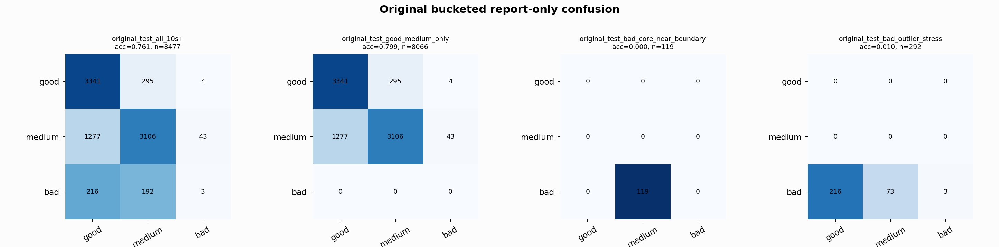

# Original Bucketed Checkpoint Report

Report-only evaluation. It is not used for Clean/SemiClean/node selection.

## Checkpoint

- Variant: `nl_n7180_gm_trim_bad_boundaryblocks_origbridge_lowqrsbrid_db6d50ec72f9`
- Prediction mode: `simple_pc1_gm_gate_t254`

## Buckets

- `original_all_10s+`: n=32956, acc=0.8181, macro-F1=0.8422, recall good/medium/bad=0.7743/0.8427/0.9099
- `original_test_all_10s+`: n=8477, acc=0.7609, macro-F1=0.5254, recall good/medium/bad=0.9179/0.7018/0.0073
- `original_test_good_medium_only`: n=8066, acc=0.7993, macro-F1=0.5343, recall good/medium/bad=0.9179/0.7018/0.0000
- `original_test_bad_core_near_boundary`: n=119, acc=0.0000, macro-F1=0.0000, recall good/medium/bad=0.0000/0.0000/0.0000
- `original_test_bad_outlier_stress`: n=292, acc=0.0103, macro-F1=0.0068, recall good/medium/bad=0.0000/0.0000/0.0103
- `original_test_drop_bad_outlier_reference`: n=8185, acc=0.7877, macro-F1=0.5303, recall good/medium/bad=0.9179/0.7018/0.0000
- `original_test_good_medium_overlap`: n=7492, acc=0.7839, macro-F1=0.5228, recall good/medium/bad=0.9170/0.6607/0.0000
- `original_all_bad_core_near_boundary`: n=4084, acc=0.9709, macro-F1=0.3284, recall good/medium/bad=0.0000/0.0000/0.9709
- `original_all_bad_outlier_stress`: n=1201, acc=0.7027, macro-F1=0.2751, recall good/medium/bad=0.0000/0.0000/0.7027

## Counts

- Original all 10s+: `32956` windows.
- Original test 10s+: `8477` windows.
- Bad outlier stress is reported separately because dropping it removes most original-test bad windows.

