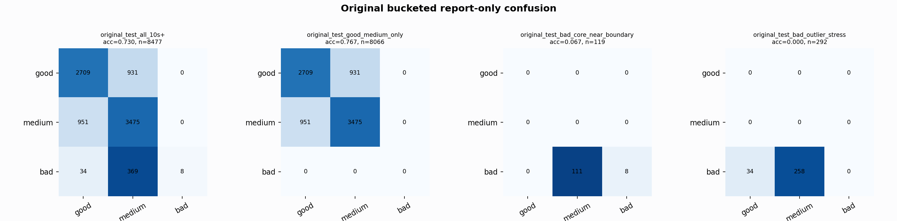

# Original Bucketed Checkpoint Report

Report-only evaluation. It is not used for Clean/SemiClean/node selection.

## Checkpoint

- Variant: `nl_n7180_gm_trim_bad_boundaryblocks_visualgate_mediumprot_e430e1072ca7`
- Prediction mode: `raw`

## Buckets

- `original_all_10s+`: n=32956, acc=0.8139, macro-F1=0.8376, recall good/medium/bad=0.8028/0.7837/0.9103
- `original_test_all_10s+`: n=8477, acc=0.7304, macro-F1=0.5108, recall good/medium/bad=0.7442/0.7851/0.0195
- `original_test_good_medium_only`: n=8066, acc=0.7667, macro-F1=0.5097, recall good/medium/bad=0.7442/0.7851/0.0000
- `original_test_bad_core_near_boundary`: n=119, acc=0.0672, macro-F1=0.0420, recall good/medium/bad=0.0000/0.0000/0.0672
- `original_test_bad_outlier_stress`: n=292, acc=0.0000, macro-F1=0.0000, recall good/medium/bad=0.0000/0.0000/0.0000
- `original_test_drop_bad_outlier_reference`: n=8185, acc=0.7565, macro-F1=0.5484, recall good/medium/bad=0.7442/0.7851/0.0672
- `original_test_good_medium_overlap`: n=7492, acc=0.7500, macro-F1=0.4998, recall good/medium/bad=0.7415/0.7578/0.0000
- `original_all_bad_core_near_boundary`: n=4084, acc=0.9726, macro-F1=0.3287, recall good/medium/bad=0.0000/0.0000/0.9726
- `original_all_bad_outlier_stress`: n=1201, acc=0.6986, macro-F1=0.2742, recall good/medium/bad=0.0000/0.0000/0.6986

## Counts

- Original all 10s+: `32956` windows.
- Original test 10s+: `8477` windows.
- Bad outlier stress is reported separately because dropping it removes most original-test bad windows.

