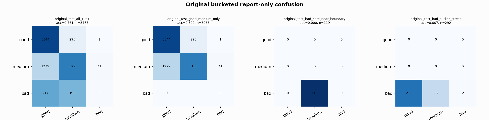

# Original Bucketed Checkpoint Report

Report-only evaluation. It is not used for Clean/SemiClean/node selection.

## Checkpoint

- Variant: `nl_n7181_gm_trim_bad_boundaryblocks_badattack_dual_n7180p_f1aa696dc526`
- Prediction mode: `simple_pc1_gm_gate_t254`

## Buckets

- `original_all_10s+`: n=32956, acc=0.8178, macro-F1=0.8418, recall good/medium/bad=0.7740/0.8427/0.9094
- `original_test_all_10s+`: n=8477, acc=0.7611, macro-F1=0.5240, recall good/medium/bad=0.9187/0.7018/0.0049
- `original_test_good_medium_only`: n=8066, acc=0.7997, macro-F1=0.5344, recall good/medium/bad=0.9187/0.7018/0.0000
- `original_test_bad_core_near_boundary`: n=119, acc=0.0000, macro-F1=0.0000, recall good/medium/bad=0.0000/0.0000/0.0000
- `original_test_bad_outlier_stress`: n=292, acc=0.0068, macro-F1=0.0045, recall good/medium/bad=0.0000/0.0000/0.0068
- `original_test_drop_bad_outlier_reference`: n=8185, acc=0.7880, macro-F1=0.5304, recall good/medium/bad=0.9187/0.7018/0.0000
- `original_test_good_medium_overlap`: n=7492, acc=0.7843, macro-F1=0.5228, recall good/medium/bad=0.9178/0.6607/0.0000
- `original_all_bad_core_near_boundary`: n=4084, acc=0.9706, macro-F1=0.3284, recall good/medium/bad=0.0000/0.0000/0.9706
- `original_all_bad_outlier_stress`: n=1201, acc=0.7011, macro-F1=0.2748, recall good/medium/bad=0.0000/0.0000/0.7011

## Counts

- Original all 10s+: `32956` windows.
- Original test 10s+: `8477` windows.
- Bad outlier stress is reported separately because dropping it removes most original-test bad windows.

