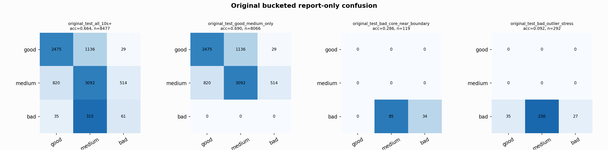

# Original Bucketed Checkpoint Report

Report-only evaluation. It is not used for Clean/SemiClean/node selection.

## Checkpoint

- Variant: `nl_n7182_gm_trim_bad_boundaryblocks_badattackwide_core122_9c92624a97fe`
- Prediction mode: `raw`

## Buckets

- `original_all_10s+`: n=32956, acc=0.7782, macro-F1=0.7951, recall good/medium/bad=0.7700/0.7200/0.9220
- `original_test_all_10s+`: n=8477, acc=0.6639, macro-F1=0.5066, recall good/medium/bad=0.6799/0.6986/0.1484
- `original_test_good_medium_only`: n=8066, acc=0.6902, macro-F1=0.4761, recall good/medium/bad=0.6799/0.6986/0.0000
- `original_test_bad_core_near_boundary`: n=119, acc=0.2857, macro-F1=0.1481, recall good/medium/bad=0.0000/0.0000/0.2857
- `original_test_bad_outlier_stress`: n=292, acc=0.0925, macro-F1=0.0564, recall good/medium/bad=0.0000/0.0000/0.0925
- `original_test_drop_bad_outlier_reference`: n=8185, acc=0.6843, macro-F1=0.5064, recall good/medium/bad=0.6799/0.6986/0.2857
- `original_test_good_medium_overlap`: n=7492, acc=0.6710, macro-F1=0.4647, recall good/medium/bad=0.6766/0.6658/0.0000
- `original_all_bad_core_near_boundary`: n=4084, acc=0.9792, macro-F1=0.3298, recall good/medium/bad=0.0000/0.0000/0.9792
- `original_all_bad_outlier_stress`: n=1201, acc=0.7277, macro-F1=0.2808, recall good/medium/bad=0.0000/0.0000/0.7277

## Counts

- Original all 10s+: `32956` windows.
- Original test 10s+: `8477` windows.
- Bad outlier stress is reported separately because dropping it removes most original-test bad windows.

