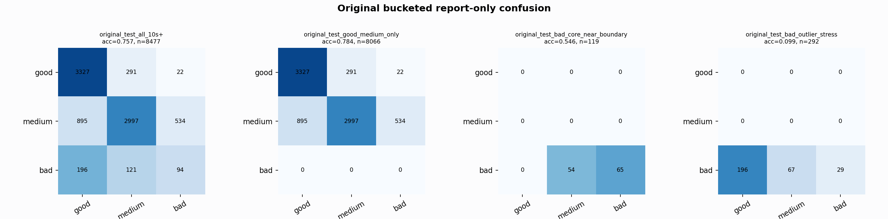

# Original Bucketed Checkpoint Report

Report-only evaluation. It is not used for Clean/SemiClean/node selection.

## Checkpoint

- Variant: `nl_n7182_gm_trim_bad_boundaryblocks_badattackwide_dual_n7_5b567b543eaf`
- Prediction mode: `simple_pc1_gm_gate_t254`

## Buckets

- `original_all_10s+`: n=32956, acc=0.8120, macro-F1=0.8247, recall good/medium/bad=0.7678/0.8259/0.9264
- `original_test_all_10s+`: n=8477, acc=0.7571, macro-F1=0.5893, recall good/medium/bad=0.9140/0.6771/0.2287
- `original_test_good_medium_only`: n=8066, acc=0.7840, macro-F1=0.5411, recall good/medium/bad=0.9140/0.6771/0.0000
- `original_test_bad_core_near_boundary`: n=119, acc=0.5462, macro-F1=0.2355, recall good/medium/bad=0.0000/0.0000/0.5462
- `original_test_bad_outlier_stress`: n=292, acc=0.0993, macro-F1=0.0602, recall good/medium/bad=0.0000/0.0000/0.0993
- `original_test_drop_bad_outlier_reference`: n=8185, acc=0.7806, macro-F1=0.5979, recall good/medium/bad=0.9140/0.6771/0.5462
- `original_test_good_medium_overlap`: n=7492, acc=0.7676, macro-F1=0.5287, recall good/medium/bad=0.9131/0.6329/0.0000
- `original_all_bad_core_near_boundary`: n=4084, acc=0.9865, macro-F1=0.3311, recall good/medium/bad=0.0000/0.0000/0.9865
- `original_all_bad_outlier_stress`: n=1201, acc=0.7219, macro-F1=0.2795, recall good/medium/bad=0.0000/0.0000/0.7219

## Counts

- Original all 10s+: `32956` windows.
- Original test 10s+: `8477` windows.
- Bad outlier stress is reported separately because dropping it removes most original-test bad windows.

