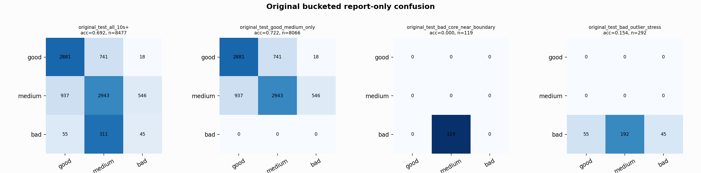

# Original Bucketed Checkpoint Report

Report-only evaluation. It is not used for Clean/SemiClean/node selection.

## Checkpoint

- Variant: `nl_n7182_gm_trim_bad_boundaryblocks_badattackwide_outlier_b9dea2cfac81`
- Prediction mode: `raw`

## Buckets

- `original_all_10s+`: n=32956, acc=0.8153, macro-F1=0.8174, recall good/medium/bad=0.8869/0.6502/0.9164
- `original_test_all_10s+`: n=8477, acc=0.6923, macro-F1=0.5180, recall good/medium/bad=0.7915/0.6649/0.1095
- `original_test_good_medium_only`: n=8066, acc=0.7220, macro-F1=0.4995, recall good/medium/bad=0.7915/0.6649/0.0000
- `original_test_bad_core_near_boundary`: n=119, acc=0.0000, macro-F1=0.0000, recall good/medium/bad=0.0000/0.0000/0.0000
- `original_test_bad_outlier_stress`: n=292, acc=0.1541, macro-F1=0.0890, recall good/medium/bad=0.0000/0.0000/0.1541
- `original_test_drop_bad_outlier_reference`: n=8185, acc=0.7115, macro-F1=0.4960, recall good/medium/bad=0.7915/0.6649/0.0000
- `original_test_good_medium_overlap`: n=7492, acc=0.7060, macro-F1=0.4885, recall good/medium/bad=0.7893/0.6288/0.0000
- `original_all_bad_core_near_boundary`: n=4084, acc=0.9699, macro-F1=0.3282, recall good/medium/bad=0.0000/0.0000/0.9699
- `original_all_bad_outlier_stress`: n=1201, acc=0.7344, macro-F1=0.2823, recall good/medium/bad=0.0000/0.0000/0.7344

## Counts

- Original all 10s+: `32956` windows.
- Original test 10s+: `8477` windows.
- Bad outlier stress is reported separately because dropping it removes most original-test bad windows.

