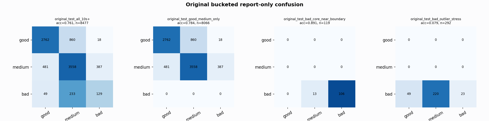

# Original Bucketed Checkpoint Report

Report-only evaluation. It is not used for Clean/SemiClean/node selection.

## Checkpoint

- Variant: `nl_n7183_gm_trim_bad_boundaryblocks_badattackwide_dual_n7_4868958ba680`
- Prediction mode: `raw`

## Buckets

- `original_all_10s+`: n=32956, acc=0.7816, macro-F1=0.8088, recall good/medium/bad=0.6795/0.8690/0.9351
- `original_test_all_10s+`: n=8477, acc=0.7608, macro-F1=0.6180, recall good/medium/bad=0.7588/0.8039/0.3139
- `original_test_good_medium_only`: n=8066, acc=0.7835, macro-F1=0.5357, recall good/medium/bad=0.7588/0.8039/0.0000
- `original_test_bad_core_near_boundary`: n=119, acc=0.8908, macro-F1=0.3141, recall good/medium/bad=0.0000/0.0000/0.8908
- `original_test_bad_outlier_stress`: n=292, acc=0.0788, macro-F1=0.0487, recall good/medium/bad=0.0000/0.0000/0.0788
- `original_test_drop_bad_outlier_reference`: n=8185, acc=0.7851, macro-F1=0.6475, recall good/medium/bad=0.7588/0.8039/0.8908
- `original_test_good_medium_overlap`: n=7492, acc=0.7671, macro-F1=0.5261, recall good/medium/bad=0.7562/0.7771/0.0000
- `original_all_bad_core_near_boundary`: n=4084, acc=0.9966, macro-F1=0.3328, recall good/medium/bad=0.0000/0.0000/0.9966
- `original_all_bad_outlier_stress`: n=1201, acc=0.7261, macro-F1=0.2804, recall good/medium/bad=0.0000/0.0000/0.7261

## Counts

- Original all 10s+: `32956` windows.
- Original test 10s+: `8477` windows.
- Bad outlier stress is reported separately because dropping it removes most original-test bad windows.

