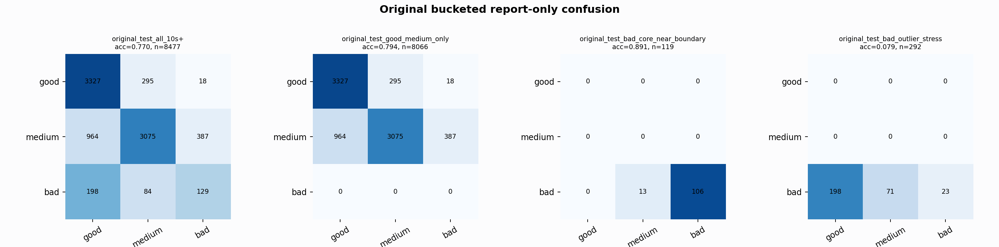

# Original Bucketed Checkpoint Report

Report-only evaluation. It is not used for Clean/SemiClean/node selection.

## Checkpoint

- Variant: `nl_n7183_gm_trim_bad_boundaryblocks_badattackwide_dual_n7_4868958ba680`
- Prediction mode: `simple_pc1_gm_gate_t254`

## Buckets

- `original_all_10s+`: n=32956, acc=0.8188, macro-F1=0.8363, recall good/medium/bad=0.7709/0.8378/0.9351
- `original_test_all_10s+`: n=8477, acc=0.7704, macro-F1=0.6240, recall good/medium/bad=0.9140/0.6948/0.3139
- `original_test_good_medium_only`: n=8066, acc=0.7937, macro-F1=0.5426, recall good/medium/bad=0.9140/0.6948/0.0000
- `original_test_bad_core_near_boundary`: n=119, acc=0.8908, macro-F1=0.3141, recall good/medium/bad=0.0000/0.0000/0.8908
- `original_test_bad_outlier_stress`: n=292, acc=0.0788, macro-F1=0.0487, recall good/medium/bad=0.0000/0.0000/0.0788
- `original_test_drop_bad_outlier_reference`: n=8185, acc=0.7951, macro-F1=0.6543, recall good/medium/bad=0.9140/0.6948/0.8908
- `original_test_good_medium_overlap`: n=7492, acc=0.7779, macro-F1=0.5309, recall good/medium/bad=0.9131/0.6527/0.0000
- `original_all_bad_core_near_boundary`: n=4084, acc=0.9966, macro-F1=0.3328, recall good/medium/bad=0.0000/0.0000/0.9966
- `original_all_bad_outlier_stress`: n=1201, acc=0.7261, macro-F1=0.2804, recall good/medium/bad=0.0000/0.0000/0.7261

## Counts

- Original all 10s+: `32956` windows.
- Original test 10s+: `8477` windows.
- Bad outlier stress is reported separately because dropping it removes most original-test bad windows.

